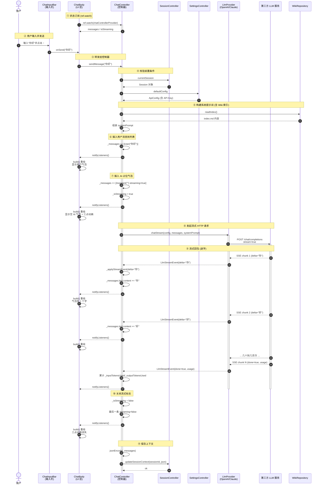
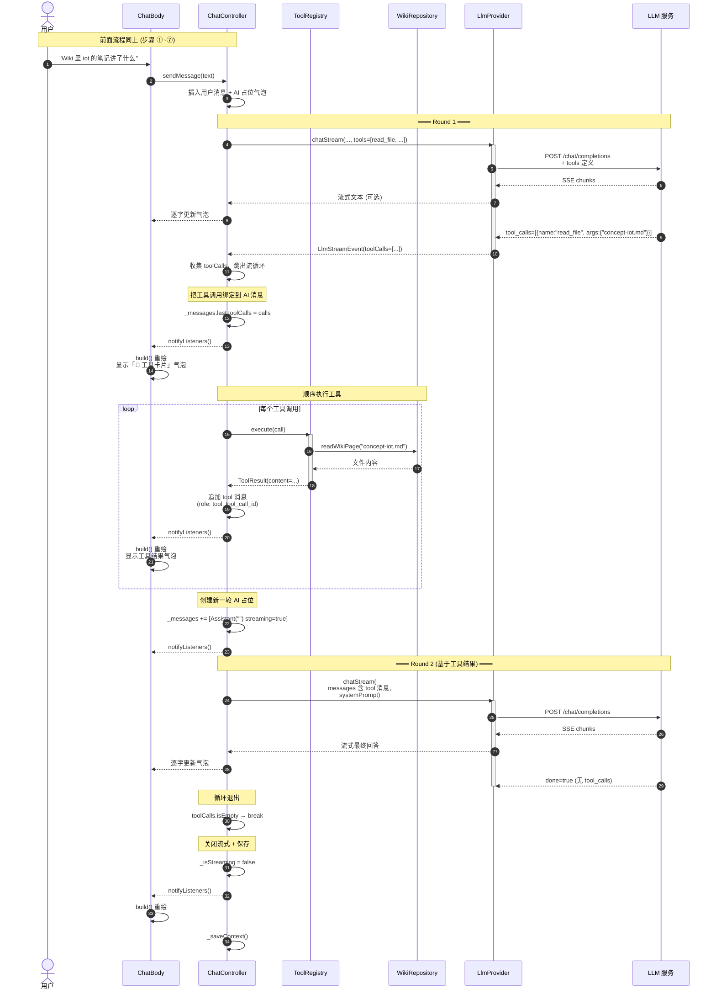
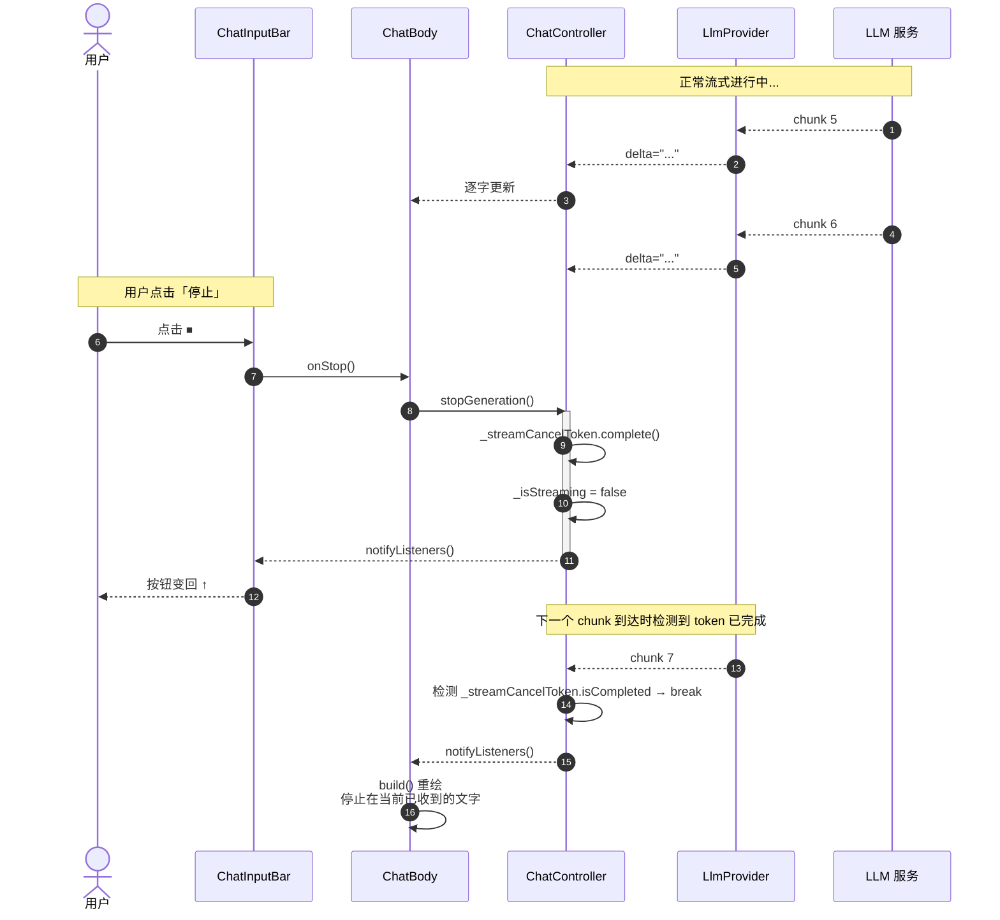
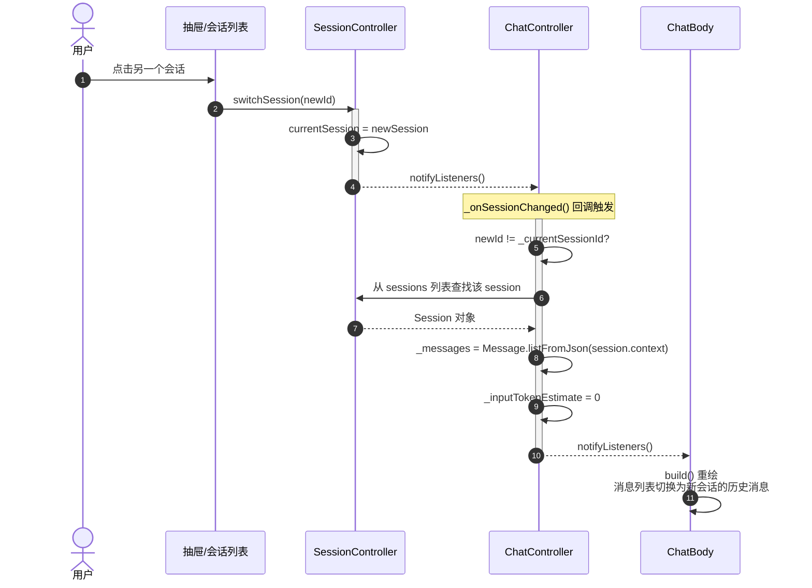
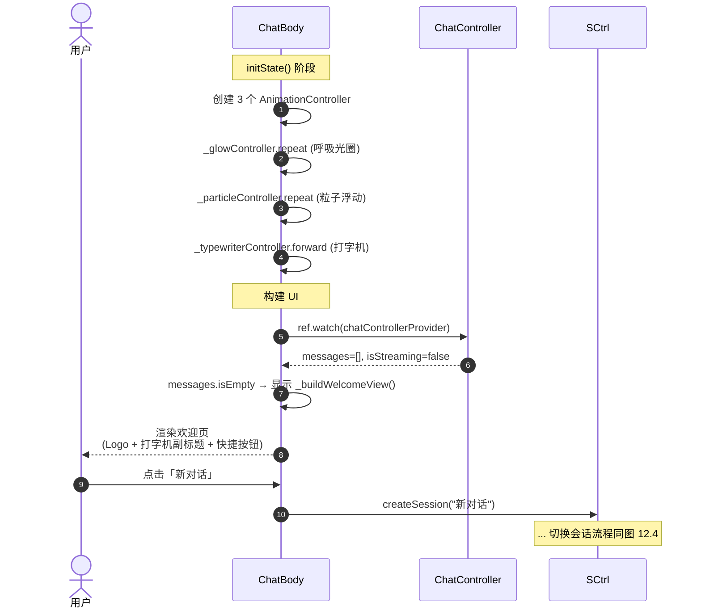

# ChatBody 架构与调用链路详解

> 文档版本：1.0  
> 适用文件：`lib/presentation/pages/chat_body.dart`  
> 关联文件：`lib/application/controller/chat_controller.dart`  
> 阅读对象：希望理解 Owl 对话页"如何调 AI、如何回显、如何更新"的开发者

---

## 目录

- [一、类身份速览](#一类身份速览)
- [二、核心机制 1：状态订阅（Riverpod ChangeNotifier）](#二核心机制-1状态订阅riverpod-changenotifier)
- [三、核心机制 2：发送消息（调用入口）](#三核心机制-2发送消息调用入口)
- [四、核心机制 3：消息列表渲染（如何"显示"AI 回复）](#四核心机制-3消息列表渲染如何显示ai-回复)
- [五、ChatController 内部：AI 是怎么被调起来的](#五chatcontroller-内部ai-是怎么被调起来的)
- [六、消息流的完整时间线（举例子）](#六消息流的完整时间线举例子)
- [七、特殊机制：工具调用循环（Tool Calling）](#七特殊机制工具调用循环tool-calling)
- [八、回调机制：Controller → UI 的"特殊通知"](#八回调机制controller--ui-的特殊通知)
- [九、副作用：动画与滚动](#九副作用动画与滚动)
- [十、整体调用链（一图流）](#十整体调用链一图流)
- [十一、为什么这么设计：三个核心思想](#十一为什么这么设计三个核心思想)
- [十二、时序图](#十二时序图)

---

## 一、类身份速览

`ChatBody` 是**对话页的"显示层"**。它**自己不直接调 AI**，而是：

```
用户输入 → ChatBody (UI)
            ↓ 把"发送"指令告诉
          ChatController (大脑/调度)
            ↓ 指挥
          LlmProvider (真正的 AI 通信兵)
            ↓ 流式回包
          ChatController 更新消息列表
            ↓ 通知
          ChatBody 重建界面显示出来
```

`ChatBody` 只负责 3 件事：

1. **画界面**
2. **把用户的操作转发给 ChatController**
3. **订阅 ChatController 的状态变化并重绘**

---

## 二、核心机制 1：状态订阅（Riverpod ChangeNotifier）

```dart
class ChatBody extends ConsumerStatefulWidget  // ← Consumer 表示可订阅 Provider
class _ChatBodyState ... with TickerProviderStateMixin {
```

`ConsumerStatefulWidget` 是 Riverpod 提供的特殊 Widget，它让你能用 `ref.watch(...)` 监听数据变化。

### 订阅消息列表

```dart
@override
Widget build(BuildContext context) {
  final chatCtrl = ref.watch(chatControllerProvider);  // ← 关键！
  final messages = chatCtrl.messages;
  final isStreaming = chatCtrl.isStreaming;
```

**这一行的含义**：

- `ref.watch` 不是"读一次值"，而是"订阅这个 Provider"
- 只要 `ChatController` 调用 `notifyListeners()`，整个 `build` 方法就会**重新执行**
- 重新执行就会拿到最新的 `messages` 列表，然后 `ListView.builder` 会用新数据重新渲染

**这就是"更新"的魔法**：UI 不需要手动刷新，状态变了 → 框架自动 rebuild。

---

## 三、核心机制 2：发送消息（调用入口）

```dart
ChatInputBar(
  onSend: (text) {
    chatCtrl.sendMessage(text);              // ← 把文本甩给 Controller
    WidgetsBinding.instance.addPostFrameCallback((_) {
      _scrollToBottom();                     // ← 发完后滚到底部
    });
  },
  isStreaming: isStreaming,                   // ← 告诉输入框现在是不是在生成
  onStop: () => chatCtrl.stopGeneration(),   // ← 停止按钮
  tokenCount: messages.isNotEmpty ? chatCtrl.inputTokenEstimate : null,
  providerName: chatCtrl.activeProviderName,
  modelName: chatCtrl.activeModelName,
  onAttach: () {
    ScaffoldMessenger.of(context).showSnackBar(
      const SnackBar(content: Text('文件上传功能即将上线')),
    );
  },
),
```

`ChatInputBar` 是底部那个输入框组件（豆包式圆角输入 + 发送按钮）。它对外只暴露 4 个核心回调：

- `onSend(text)` — 用户按了发送
- `isStreaming` — 控制显示「发送按钮」还是「停止按钮」
- `onStop()` — 用户按了停止
- `tokenCount` — 显示当前用了多少 token

`ChatBody` 完全是**中间人**：把按钮事件转给 Controller，把 Controller 的状态再传给输入框。

---

## 四、核心机制 3：消息列表渲染（如何"显示"AI 回复）

```dart
Widget _buildMessageList(BuildContext context, List<Message> messages, bool isStreaming) {
  return ListView.builder(
    controller: _scrollController,
    padding: const EdgeInsets.only(
      top: AppSpacing.base,
      bottom: AppSpacing.base,
    ),
    itemCount: messages.length,
    itemBuilder: (context, index) {
      final msg = messages[index];
      final isUser = msg.role == MessageRole.user;
      return ChatBubble(
        role: isUser ? ChatBubbleRole.user : ChatBubbleRole.assistant,
        content: msg.content,
        reasoning: msg.reasoning,
        toolCalls: msg.toolCalls,
        isStreaming: index == messages.length - 1 && isStreaming && !isUser,
        onWikiRefTap: (ref) {
          ScaffoldMessenger.of(context).showSnackBar(
            SnackBar(content: Text('打开 Wiki: $ref')),
          );
        },
        onLongPress: () => _showMessageContextMenu(msg),
      );
    },
  );
}
```

**关键点**：

1. `ListView.builder` 懒渲染：只画屏幕上看得到的，消息再多也不卡
2. `isStreaming` 只在**最后一条消息** 且 **是 AI 消息** 时为 true，这样气泡会显示"打字光标"动画
3. 每条消息走 `ChatBubble`（气泡组件），区分用户气泡（蓝色靠右）和 AI 气泡（深色靠左）
4. `onWikiRefTap` 处理 AI 回复中 `[[wikilink]]` 的点击跳转
5. `onLongPress` 弹出消息操作菜单（复制/重新生成/Wiki 搜索/添加到 Wiki）

---

## 五、ChatController 内部：AI 是怎么被调起来的

`ChatBody` 不调 AI，调 AI 的是 `ChatController.sendMessage()`。它的工作流程是 **6 步流水线**。

### 步骤 1：校验前置条件

```dart
final session = _sessionCtrl.currentSession;       // 有没有选会话？
final config = _settingsCtrl.defaultConfig;         // 有没有配置 API Key？
if (config == null) { onError?.call('请先配置...'); return; }
```

### 步骤 2：插入用户消息到消息列表

```dart
final userMessage = Message.user(sessionId: session.id, content: content.trim());
_messages = [..._messages, userMessage];
notifyListeners();                                  // ← 触发 UI rebuild，气泡立刻出现
```

### 步骤 3：插入 AI 占位气泡

```dart
final assistantMessage = Message.assistant(sessionId: session.id, content: '')
    .copyWith(streaming: true);                     // streaming=true 表示"还在打字"
_messages = [..._messages, assistantMessage];
_isStreaming = true;
_streamCancelToken = Completer<void>();
notifyListeners();
```

此时用户看到的就是：**自己的消息 + 一个空的 AI 气泡（带三点跳动动画）**

### 步骤 4：解析 Provider，启动流式调用

```dart
final provider = _providerCtrl.resolveProvider(config);  // OpenAI? Claude? DeepSeek?
final tools = _toolRegistry.listDefinitions();           // 可用工具清单
await for (final event in provider.chatStream(           // ← 真正的网络请求
  config,
  messages: contextMessages,
  systemPrompt: systemPrompt,
  tools: tools.isNotEmpty ? tools : null,
)) {
  if (_streamCancelToken?.isCompleted == true) break;   // 用户点了停止
  if (event.toolCalls != null && event.toolCalls!.isNotEmpty) {
    toolCalls.addAll(event.toolCalls!);                   // AI 想调工具
    continue;
  }
  _applyStreamEvent(event);                              // 普通文字增量
}
```

### 步骤 5：每收到一个字就更新最后一条消息

```dart
void _applyStreamEvent(LlmStreamEvent event) {
  if (event.delta != null) {
    final updated = [..._messages];
    final lastIdx = updated.length - 1;                  // 找到最后那条 AI 气泡
    updated[lastIdx] = updated[lastIdx].copyWith(
      content: updated[lastIdx].content + event.delta!,  // 追加一个字
      streaming: true,
    );
    _messages = updated;
    notifyListeners();                                    // UI 重新画，看到字多了
  }
}
```

**这就是"逐字显示打字机效果"的本质**：

- LLM 服务端每生成几个字，就通过网络推送一个 `delta`（增量片段）
- Controller 把这个增量**追加到**最后一条 AI 消息的 content 后面
- 调 `notifyListeners()` → UI 自动 rebuild → 用户看到多了一个字

### 步骤 6：保存会话上下文

```dart
Future<void> _saveContext(String sessionId) async {
  final jsonStr = jsonEncode(tail.map((m) => m.toJson()).toList());
  await _sessionCtrl.updateSessionContext(sessionId, jsonStr);   // 写内存仓库
  unawaited(_compressor.compressIfNeeded(...));                  // 超阈值时触发压缩
}
```

---

## 六、消息流的完整时间线（举例子）

假设用户问「你好」：

```
T0  用户点击发送
    │
    ├─ ChatInputBar.onSend("你好")
    │   ↓
    ├─ ChatController.sendMessage("你好")
    │
T1  ├─ _messages = [User("你好")]
    ├─ notifyListeners()  ──→  UI rebuild，显示用户气泡
    │
T2  ├─ _messages = [User("你好"), Assistant("") streaming=true]
    ├─ _isStreaming = true
    ├─ notifyListeners()  ──→  UI rebuild，显示空的 AI 气泡（带三点动画）
    │
T3  ├─ provider.chatStream(...) 发起 HTTP 请求到 OpenAI
    │
T4  ── 网络返回 delta="你" ──→
    │   _applyStreamEvent(delta="你")
    │   _messages = [User("你好"), Assistant("你") streaming=true]
    │   notifyListeners()  ──→  UI rebuild，看到 1 个字
    │
T5  ── 网络返回 delta="好" ──→
    │   _messages = [..., Assistant("你好")]   ← 继续追加
    │   notifyListeners()
    │
... 重复几十上百次 ...
    │
T_end  ── 网络返回 done=true ──→
    │
    ├─ _messages = [..., Assistant("你好，我是 Owl...", streaming=false)]
    ├─ _isStreaming = false
    ├─ notifyListeners()  ──→  UI rebuild，三点动画消失，光标消失
    │
    └─ await _saveContext(sessionId)  ──→  把整个对话序列化成 JSON 存进内存仓库
```

---

## 七、特殊机制：工具调用循环（Tool Calling）

`ChatController` 支持 AI 主动调用工具（比如读 Wiki 文件）。流程：

```dart
for (var round = 0; round < _maxToolRounds; round++) {  // 最多 3 轮
  final toolCallsThisRound = await _streamOnce(...);     // 1. 让 AI 回答

  if (toolCallsThisRound.isEmpty) break;                  // 2. 没要工具？结束

  _appendToolCallMessages(toolCallsThisRound);           // 3. 把"我想调用工具"显示成卡片

  for (final call in toolCallsThisRound) {
    final result = await _toolRegistry.execute(call);    // 4. 真去执行工具（如读文件）
    _appendToolResultMessage(result);                    // 5. 把工具结果追加到消息流
  }

  // 6. 创建新的 AI 占位，让 AI 基于工具结果再回答一轮
  _messages = [..._messages, Message.assistant(...).copyWith(streaming: true)];
}
```

**用户在气泡流中看到的**：

```
👤 你：帮我看看 Wiki 里关于 iot 的笔记
🤖 AI：[空气泡，带三点]
🔧 工具卡片：调用 read_file("concept-iot.md")
📁 工具结果：[显示文件内容]
🤖 AI：[基于文件内容生成的答案，逐字出现]
```

---

## 八、回调机制：Controller → UI 的"特殊通知"

Controller 不能直接 `context.showSnackBar()`（它不知道 UI 在哪），所以用回调：

```dart
// ChatController 暴露两个钩子
void Function(String message)? onWarning;
void Function(String message)? onError;
```

```dart
// ChatBody 在 initState 挂上
chatCtrl.onError = (msg) {
  ScaffoldMessenger.of(context).showSnackBar(
    SnackBar(content: Text(msg), backgroundColor: AppColors.error),
  );
};
```

这样 Controller 只要 `onError?.call('Token 超限')`，UI 就能弹 SnackBar。

---

## 九、副作用：动画与滚动

### 打字机动画（欢迎页用）

```dart
_typewriterController = AnimationController(
  vsync: this,
  duration: Duration(milliseconds: _subtitleText.length * 80),  // 13字 × 80ms
)..addListener(() {
  final idx = (_typewriterController.value * _subtitleText.length).floor();
  setState(() {
    _displayedSubtitle = _subtitleText.substring(0, idx);  // 截取前 N 个字
  });
})..forward();
```

> **注**：这个动画和 AI 流式回复**无关**，只用于欢迎页副标题。

### 滚动到底部

```dart
void _scrollToBottom() {
  Future.delayed(const Duration(milliseconds: 100), () {
    if (_scrollController.hasClients) {
      _scrollController.animateTo(
        _scrollController.position.maxScrollExtent,  // 滚到最底
        duration: const Duration(milliseconds: 200),
        curve: Curves.easeOut,
      );
    }
  });
}
```

为什么 delay 100ms？因为要等新消息把 ListView 撑高后再滚，否则 maxScrollExtent 还是旧值。

---

## 十、整体调用链（一图流）

```
┌─────────────────────────────────────────────────────────────┐
│ 用户操作                                                     │
│  ├─ 点发送 ─→ ChatInputBar.onSend(text)                     │
│  ├─ 点停止 ─→ ChatInputBar.onStop()                         │
│  └─ 滑抽屉 ─→ SessionController 切换 → ChatController 自动加载│
└─────────────────────────────────────────────────────────────┘
                          ↓
┌─────────────────────────────────────────────────────────────┐
│ ChatController (大脑)                                        │
│                                                              │
│  sendMessage(text)                                           │
│   ├─ 1. 检查 session + config                               │
│   ├─ 2. 插用户消息 ─→ notifyListeners()                     │
│   ├─ 3. 插 AI 占位气泡 ─→ notifyListeners()                 │
│   ├─ 4. provider.chatStream() ◄── 真正发 HTTP 请求          │
│   │      │                                                  │
│   │      └─ 每收到一段 ─→ _applyStreamEvent(delta)           │
│   │                       └─ 更新 _messages ─→ notifyListeners()
│   ├─ 5. (可选) 工具调用循环                                  │
│   ├─ 6. 关闭 streaming 标志 ─→ notifyListeners()            │
│   └─ 7. _saveContext()  ─→ 内存仓库                          │
└─────────────────────────────────────────────────────────────┘
                          ↓
┌─────────────────────────────────────────────────────────────┐
│ UI 层 (ChatBody)                                             │
│                                                              │
│  ref.watch(chatControllerProvider)  ◄── 任何 notifyListeners │
│           ↓                                                 │
│  build() 重新执行                                           │
│           ↓                                                 │
│  ListView.builder 用新 _messages 重绘                        │
│           ↓                                                 │
│  用户看到：多了一个字 / 滚动到底 / 三点动画停止                │
└─────────────────────────────────────────────────────────────┘
```

---

## 十一、为什么这么设计：三个核心思想

1. **单向数据流**：UI 只读不写，所有状态变更都走 Controller 的 `notifyListeners()`。这样 UI 代码简单、可预测、易调试。

2. **流式增量更新**：LLM 是长连接流式返回的，每次只推几个字。Controller 把"增量 delta"翻译成"消息列表更新 + 通知"，UI 只需要 ListView 就能渲染出打字机效果。

3. **关注点分离**：
   - `ChatBody` 知道"怎么画"
   - `ChatController` 知道"业务逻辑"
   - `LlmProvider` 知道"怎么和 AI 服务器说话"
   - 三者各司其职，任意一层换掉都不影响其他层（比如把 OpenAI 换成 Claude，只换 Provider，Controller 和 UI 一行不用动）。

---

## 十二、时序图

### 12.1 正常对话主流程



### 12.2 工具调用循环（Tool Calling）

> 用户问「Wiki 里关于 iot 的笔记讲了什么」→ AI 主动调用 `read_file` 读 Wiki。



### 12.3 用户中途停止生成



### 12.4 切换会话



### 12.5 首次启动欢迎页 + 空消息



---

## 关键节点速查表

| 步骤 | 调用方 | 被调用方 | 触发的事件 |
|---|---|---|---|
| ① | ChatBody | ChatController | `ref.watch` 订阅 |
| ③ | ChatBody | ChatController | `sendMessage(text)` |
| ⑤ | ChatController | WikiRepository | `readIndex()` 取 Wiki 索引 |
| ⑥⑦ | ChatController | ChatController | `notifyListeners()` 触发 UI 重建 |
| ⑧ | ChatController | LlmProvider | `chatStream()` 发 HTTP |
| ⑨×N | LlmProvider | ChatController | `LlmStreamEvent(delta)` 流式回包 |
| ⑨×N | ChatController | ChatBody | `notifyListeners()` 逐字刷新 |
| ⑨ | ChatController | ToolRegistry | `execute(call)` 工具调用 |
| ⑩ | ChatController | ChatBody | `notifyListeners()` 关闭流式标志 |
| ⑪ | ChatController | SessionController | `updateSessionContext()` 持久化 |
| 停止 | 用户 | ChatController | `stopGeneration()` → cancel token |

---

**核心规律**：整条时序只有 **1 个同步起点**（用户点发送）和 **N 次 `notifyListeners()`**（每次流式回包都触发 UI 重建）。UI 从不主动拉数据，永远是「数据变了 → Controller 喊一声 → UI 自动重画」。

---

> 文档结束。如需进一步了解 ①`LlmProvider` 如何发 HTTP 请求 ②Tool Calling 协议细节 ③ContextCompressor 压缩策略 ④在 `ChatBody` 加"中断生成"按钮动画，请补充反馈。
