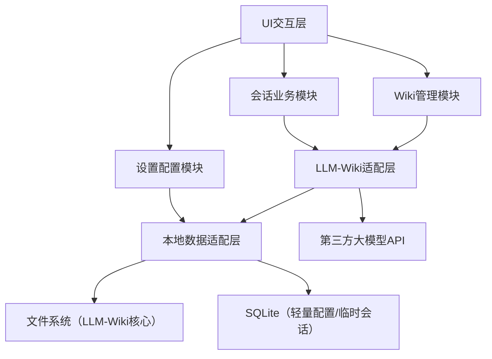
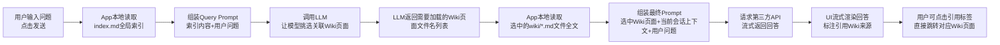
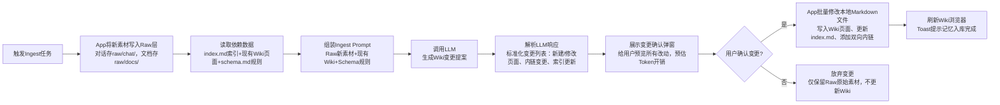

# PRD：LLM-Wiki 智能对话应用（Flutter 纯客户端版）

**文档版本**：2.0

**修订日期**：2026 年 09 月 09 日

**所属项目**：Owl

**文档类型**：正式产品需求文档

**适用角色**：前端 / 客户端架构师、Flutter 开发、UI/UX 设计师、测试工程师、产品经理


***

## 1. 文档概述

### 1.1 目的

本文档为「LLM-Wiki 智能对话应用」的完整落地需求文档，**无自建后端、纯 Flutter 客户端实现**，基于本地文件系统实现 Karpathy 原版 LLM-Wiki 范式，彻底摒弃 RAG，以用户自备第三方大模型 API 为核心交互通路。文档覆盖产品架构设计、功能流程设计、UX/UI 规范、接口定义、非功能约束及测试要求，指导开发团队独立完成从 0 到 1 的 MVP 版本开发。

### 1.2 核心定位

一款**持久化体外大脑对话工具**，区别于普通 AI 聊天 App：


* 不依赖云端数据库、不做用户体系、不存用户对话 / 知识到第三方服务器

* 采用「LLM-Wiki 摄入编译范式」：新增对话 / 文档时一次性提炼、结构化存储为本地 Markdown 知识库；问答时通过知识库索引按需检索加载对应页面，而非实时解析原始素材

* 所有数据（对话、知识库、API 配置）全程留存用户本地设备，用户可完全自主备份、迁移、编辑知识库

### 1.3 目标用户


* 高频 AI 对话用户，对记忆持续性有强需求（跨会话追踪项目、个人成长记录）

* 知识管理爱好者，习惯用 Markdown、支持 Obsidian 迁移的用户

* 对数据隐私敏感，不愿将对话 / 个人知识上传到第三方平台的用户

* 自备大模型 API Key（OpenAI、Anthropic、Gemini 及兼容 OpenAI 格式的国内开源模型）的用户

### 1.4 需求约束


| 维度   | 约束细节                                                                                                                                                               |
| ---- | ------------------------------------------------------------------------------------------------------------------------------------------------------------------ |
| 技术栈  | 纯 Flutter 开发，兼容 Android 10+、iOS 15+；核心依赖：`path_provider`（文件管理）、`dart:io`（文件读写）、`sqflite`（轻量配置存储）、`flutter_markdown`（Wiki 渲染）、`dio`（API 请求）、`tiktoken`（本地 Token 计数） |
| 架构约束 | 无自建后端、无向量库、无 RAG；严格遵循 Karpathy LLM-Wiki 三层结构，知识库完全采用本地 Markdown 文件管理                                                                                               |
| 外部依赖 | 仅依赖用户配置的第三方大模型 API（兼容 OpenAI ChatCompletion 格式）；无其他云端服务依赖                                                                                                          |
| 端侧能力 | 必须申请设备文件读写权限；API Key 采用端侧加密存储；会话上下文仅留存内存 / 本地轻量数据库                                                                                                                 |
| 合规要求 | 隐私协议明确告知用户数据全量存储在本地，API Key 由用户自持，App 不采集、不上传任何用户数据                                                                                                                |
| 功能裁剪 | 永久砍掉：用户登录 / 云端同步、向量检索 / RAG、Agent 联网搜索、在线支付、多设备协同                                                                                                                  |


***

## 2. 产品架构设计（架构师指导级）

### 2.1 整体分层架构




#### 分层说明


1. **UI 交互层**：对话页、Wiki 浏览器页、Wiki 编辑器页、设置页，负责用户输入接收与结果渲染

2. **业务模块层**：拆分会话核心、Wiki 知识管理、系统配置三大独立业务域，解耦逻辑

3. **LLM-Wiki 适配层**：封装 Ingest（知识摄入）、Query（知识查询）、Lint（知识巡检）三大核心范式，统一组装 Prompt、调用文件接口

4. **本地数据适配层**：统一封装文件读写、SQLite 操作，向上屏蔽底层存储差异，提供标准化知识库操作 API

5. **存储层**：

* 文件系统：全量存储 LLM-Wiki 知识库（Raw 原始素材、Wiki 结构化页面、全局索引、Schema 规则）

* SQLite：仅存储用户 API 配置、会话临时上下文、本地 Token 消耗统计，不存储任何 Wiki 知识内容

1. **外部 API 层**：适配第三方大模型接口，统一请求 / 响应格式，支持多模型快速切换

#### v0.2 实际落地架构（面向接口设计）

v0.2 版本将上述逻辑架构细化为可扩展的代码分层：

```
lib/
├── core/                     ← 核心层（零外部依赖，纯 Dart）
│   ├── model/                ← 不可变数据模型（Message, Session, ApiConfig, WikiPage）
│   ├── prompt/               ← Prompt 模板（Query, Ingest, SessionName）
│   └── util/                 ← 工具类（TokenCounter）
├── data/                     ← 数据层（实现接口 + 外部集成）
│   ├── repository/           ← 仓库接口（I*/IXxx） + Drift/文件系统实现
│   ├── database/             ← Drift 数据库定义（3 表：sessions, configs, tokens）
│   └── agents/               ← AgentSpec 定义（对话 Agent、生图 Agent、检索 Agent）
├── application/              ← 应用层（GetX Controllers + 依赖注入）
│   ├── controller/           ← ChatController, SessionController, SettingsController, WikiController
│   └── service/              ← InitService（启动编排）
├── presentation/             ← 表现层（UI）
│   ├── pages/                ← ChatBody, WikiBody, SettingsBody
│   ├── widgets/              ← ChatBubble(Markdown), ChatInputBar, SectionPanel 等
│   └── router/               ← GoRouter + StatefulShellRoute（3 Tab）
├── design_system/            ← 设计系统（Colors, Typography, Spacing, Shadows, Theme）
├── app.dart                  ← GetMaterialApp.router 根组件
└── main.dart                 ← 入口（初始化 + DI）
```

**关键面向接口设计**：

| 接口 | 实现 | 说明 |
|------|------|------|
| `ISessionRepository` | `SessionRepository`(Drift) | 会话 CRUD，可替换为不同存储 |
| `IConfigRepository` | `ConfigRepository`(Drift) | API 配置管理 |
| `IWikiRepository` | `WikiRepository`(文件系统) | Wiki 文件读写 |
| `AgentSpec` | 本地抽象层 | Agent 配置，可扩展接入 agentlib 等框架 |

**技术选型**：

| 维度 | v0.1 | v0.2 |
|------|------|------|
| 状态管理 | 纯 setState | **GetX** (Controller + DI) |
| 路由 | MaterialApp(home:) | **GoRouter** (StatefulShellRoute) |
| 数据库 | 无 | **Drift** (3 表) |
| Markdown | 无 | **flutter_markdown** (对话气泡 + Wiki 预览) |
| HTTP | 无 | **Dio** (API 连通测试 + LLM 调用) |

### 2.2 LLM-Wiki 文件架构（核心存储规范）

严格遵循「Raw-Wiki-Index」三层结构，在用户设备私有存储下固定创建`llm-wiki`根目录，**所有知识以 Markdown 文件形式落地，无任何二进制加密，用户可直接导出编辑**。


```
llm-wiki/               # 应用私有存储根目录，App首次启动自动创建

├─ schema.md            # Schema规则层：给LLM的Wiki编写规范，固定不可删除

├─ index.md             # Wiki全局索引目录：导航用，存储所有Wiki页面标题+短摘要，不存具体知识

├─ raw/                 # Raw原始素材层：只读，永不被LLM修改，仅用于溯源

│  ├─ chat/             # 原始对话记录目录，每个会话对应一个独立md文件

│  │  └─ chat\_xxx.md

│  └─ docs/             # 导入PDF/文档的原始文本，每个文件对应一个独立md

│     └─ doc\_xxx.md

└─ wiki/                # Wiki结构化页面层：LLM可读写，核心持久化知识存储

&#x20;  ├─ profile.md        # 固定用户画像页面，长期记忆核心实体页

&#x20;  ├─ sessions/         # 会话短期记忆归档目录，每个会话提炼后生成独立md

&#x20;  │  └─ session\_xxx.md

&#x20;  └─ concepts/          # 长期事实/项目/概念目录，跨会话复用知识

&#x20;     ├─ project\_xxx.md

&#x20;     └─ tech\_xxx.md
```

#### 三层核心定义


1. **Raw 原始素材层**

* 写入规则：用户每完成一轮对话、导入新 PDF / 文档时，将原始内容原封不动写入`raw/chat/`或`raw/docs/`，文件名采用时间戳 + 唯一 ID 生成

* 权限约束：App 内所有逻辑**仅可读、不可写、不可修改**，作为 Wiki 内容的唯一事实溯源来源

* 用途：Wiki 内容冲突校验、用户原始对话溯源、Ingest 阶段一次性解析原料

1. **Wiki 结构化页面层**

* 存储规则：所有页面为标准 Markdown 文件，文件名即页面唯一标识，支持`[[wikilink]]`双向内链，链接格式为`[[页面文件名|显示文本]]`，省略显示文本则直接展示文件名

* 内容规范：每个页面对应单一实体 / 概念 / 会话，按`schema.md`规定的模板编写，包含来源引用、冲突标记、关联内链三个固定模块

* 操作权限：LLM 通过 App 文件接口可新建、修改、删除；用户可通过内置编辑器直接编辑、手动删除

1. **Index 全局索引目录**

* 本质：Markdown 格式的清单文件，维护所有 Wiki 页面的元数据摘要，**不存储任何具体知识内容**

* 格式规范：每行采用`- [[页面文件名]]｜页面标题｜一句话摘要｜标签`的固定格式，按标签 / 目录分组排版

* 核心作用：Query 查询阶段作为轻量导航发送给 LLM，让模型快速识别需要加载的 Wiki 页面，避免全量传输 Wiki 内容

1. **Schema 规则层**

* 本质：固定的 Markdown 规则文件，存储给 LLM 的系统级提示词，规定 Wiki 编写格式、冲突校验规则、内链写法、页面命名规范

* 初始化逻辑：App 首次启动自动写入默认规则，用户可通过设置页查看 / 手动修改，不可删除

### 2.3 核心模块划分


| 模块名称      | 职责描述                     | 核心逻辑                                                                 |
| --------- | ------------------------ | -------------------------------------------------------------------- |
| 会话管理模块    | 对话 UI 渲染、消息收发、临时上下文维护    | 管理多会话列表、组装 Query Prompt、流式渲染 LLM 响应、记录原始对话到 Raw 层                    |
| Wiki 摄入模块 | 知识提炼、Wiki 文件变更、索引更新      | 触发 Ingest 流程、调用 LLM 生成 Wiki 变更提案、用户确认后读写本地 Markdown 文件、同步更新 index.md |
| Wiki 巡检模块 | 知识库维护、断链修复、冲突标记          | 遍历所有 Wiki 页面、提交 Lint 任务给 LLM、生成维护提案、用户确认后批量修改文件（V2 版本落地）             |
| 文件适配模块    | 封装所有文件读写操作               | 提供标准化 API：读取索引、读取指定 Wiki 页面、写入 Raw 素材、更新 Wiki 页面、解析`[[wikilink]]`    |
| 配置管理模块    | API 配置、模型切换、Token 统计     | 加密存储 API Key、维护多模型列表、本地 Token 计数、Token 消耗告警逻辑                        |
| Wiki 渲染模块 | 内置 Wiki 浏览器、Markdown 编辑器 | 渲染 Wiki 页面、支持内链跳转、编辑 Markdown 实时预览、文件目录浏览                            |


***

## 3. 核心功能详细需求（PRD 主流程）

### 3.1 全局功能规范

#### 3.1.1 数据持久化规则


* 所有 Wiki 知识、原始对话、导入文档**仅存储在用户设备私有存储**，App 卸载数据将被清除，无自动云端备份

* API Key 采用 AES 加密存储到 SQLite 数据库，加密密钥由 App 在用户设备本地随机生成，不联网传输

* 会话临时上下文仅留存内存，App 后台杀死后自动清除；原始对话仅写入 Raw 层，不存 SQLite

#### 3.1.2 Token 消耗规则


* 所有 LLM 请求（对话、Ingest、Lint）均消耗用户自备 API Key 的 Token

* 客户端采用`tiktoken`库本地预计算 Token 消耗，发送请求前明确告知用户预估开销

* 敏感操作（Ingest、Lint）增加二次确认弹窗，展示输入 / 输出 Token 预估，避免用户无感知消耗

#### 3.1.3 三方模型适配规范

统一兼容 OpenAI `chat.completions`接口格式，用户配置时需填写：


* 模型名称（下拉选择预置项，支持自定义输入）

* API Endpoint（默认 OpenAI 官方地址，支持配置反向代理 / 国内兼容地址）

* API Key（加密存储，不会上传到任何非目标第三方服务器）

* temperature、top\_p（高级设置，默认预置通用值）


***

### 3.2 首次初始化流程

**触发时机**：用户首次启动 App，或检测到`llm-wiki`根目录不存在

**流程逻辑**：


1. App 请求设备文件读写权限，用户授权后，在私有存储下自动创建完整`llm-wiki`目录结构

2. 初始化默认`schema.md`，写入标准 LLM 规则（详见附录 A）

3. 初始化默认`index.md`，写入基础目录模板，自动创建`wiki/``profile.md`空白用户画像页

4. 跳转 API 配置引导页，强制用户完成至少一个大模型配置后，才可进入对话页

5. 【异常处理】若用户拒绝文件权限，持续弹窗引导授权，未授权前禁用所有核心功能


***

### 3.3 核心流程 1：Query 知识查询（用户对话主流程）

**目标**：用户提问时，通过 Wiki 索引按需加载关联知识，组装上下文请求 LLM 回答

**触发时机**：用户在对话页输入问题并点击发送

**流程步骤**：




**每一步开发约束**：


1. 步骤 2：仅读取`index.md`全文，不加载任何其他 Wiki 文件，索引过大时需本地压缩摘要，控制索引 Token 长度在 500Token 以内

2. 步骤 4：给 LLM 的系统提示词固定为`你是Wiki知识检索助手，下方是Wiki全局索引，根据用户问题，输出需要加载的Wiki页面文件名，格式为JSON数组，如["profile.md","project_xxx.md"]，无需输出其他内容`

3. 步骤 6：**仅加载 LLM 返回的指定页面**，不得额外加载其他 Wiki 文件，避免冗余 Token 开销

4. 步骤 7：Wiki 页面内容放在系统上下文前，优先级高于会话临时上下文

5. 步骤 9：回答末尾固定渲染引用标签，格式为`引用Wiki：[[页面1]]、[[页面2]]`，支持点击跳转


***

### 3.4 核心流程 2：Ingest 知识摄入（记忆入库流程）

**目标**：将新对话 / 导入文档一次性提炼，结构化存入 Wiki，更新索引，后续问答不再重读原始素材

**触发时机**：用户完成一轮对话（发送消息后收到完整响应）、手动导入 PDF / 文档、在对话页点击「存入记忆」按钮

**流程步骤**：




**开发约束**：


1. Raw 层写入必须先于 Wiki 更新，确保原始素材留存，写入失败时终止后续 Ingest 流程

2. Ingest Prompt 必须严格将`schema.md`规则作为系统前置提示词，LLM 响应格式固定为 JSON，包含`wiki_changes`、`index_updates`、`conflict_notes`三个字段

3. 变更确认弹窗必须展示：修改文件列表、新增内链列表、冲突检测结果、输入 / 输出 Token 预估值，用户可单独取消部分文件变更

4. 写入 Wiki 文件时，自动在页面末尾追加`> 来源引用：raw/chat/xxx.md | 写入时间：xxxx-xx-xx`，用于溯源

5. 若 LLM 检测到新旧信息冲突，需在变更提案中明确标记，弹窗高亮冲突内容，由用户选择覆盖、保留旧内容、手动编辑后写入

6. 【性能约束】Ingest 流程采用后台异步任务处理，用户可在前台继续进行其他对话操作，文件读写过程中显示加载状态


***

### 3.5 核心流程 3：Lint 知识巡检（Wiki 维护流程）

**目标**：定期维护 Wiki 知识库，修复断链、合并重复页面、标记过时内容、删除孤立页面，保持 Wiki 结构健康

**触发时机**：用户手动在 Wiki 页点击「巡检」按钮、App 启动后闲时后台触发（仅在 WiFi / 充电状态下执行，可在设置关闭）

**流程步骤**：


1. App 读取`index.md`和所有 Wiki 页面全文，解析所有`[[wikilink]]`，校验链接有效性

2. 组装 Lint Prompt，提交所有 Wiki 页面和链接校验结果给 LLM

3. LLM 返回巡检修复提案：断链修补方案、重复页面合并建议、过时内容标记、孤立页面清理建议

4. 展示巡检结果弹窗，列出所有修复内容，用户可选择性执行修复

5. 用户确认后，App 批量修改 Wiki 文件和`index.md`，同步更新双向内链

> 【注】V1 版本暂不落地该流程，仅预留入口，V2 版本完整开发


***

### 3.6 Wiki 管理功能（知识浏览 / 编辑 / 导出）

#### 3.6.1 Wiki 浏览器


* 入口：底部导航栏点击「Wiki」，默认展示文件目录视图，与`llm-wiki`目录结构完全一一对应

* 功能：


  * 按文件夹分类查看所有 Wiki 页面、Raw 原始素材，支持搜索文件名、按标签 / 修改时间筛选

  * 点击 Wiki 文件调用内置 Markdown 编辑器打开，点击 Raw 文件仅采用只读模式预览

  * 支持文件长按操作：重命名、删除、复制内容、查看溯源 Raw 文件、导出为单独 Markdown 文件

  * 目录结构支持折叠 / 展开，右上角提供「导入文件」「全部巡检」「导出 Wiki」按钮

* 交互约束：删除 Wiki 文件时，自动触发索引更新，移除`index.md`中对应条目；删除 Raw 文件时二次确认，提示删除后无法溯源

#### 3.6.2 Wiki 编辑器


* 打开方式：从 Wiki 浏览器点击 Wiki 文件、对话页点击 Wiki 引用标签、用户画像页点击编辑按钮

* 功能：


  * 分双栏编辑 / 预览模式，实时渲染 Markdown 格式，原生支持`[[wikilink]]`识别，点击链接可直接跳转对应页面

  * 顶部提供快捷插入按钮：插入 Wiki 内链、插入溯源引用、标记冲突内容、插入当前时间戳

  * 自动保存：编辑过程中每 30 秒临时存到本地缓存，用户手动点击「保存」后正式写入对应 Markdown 文件，同步更新`index.md`修改时间

  * 冲突校验：保存时 App 本地解析所有内链，校验链接页面是否存在，若检测到断链则提示用户批量修复

* 权限约束：用户编辑时不得修改文件所在目录，不得擅自修改`index.md`和`schema.md`的核心格式，格式错误时保存给出明确校验提示

#### 3.6.3 Wiki 备份与导出


* 导出整个 Wiki：用户点击设置页「导出 Wiki」按钮，将整个`llm-wiki`目录压缩为 ZIP 包，用户可保存到设备本地、分享到其他 App、导入 Obsidian 等第三方知识管理工具

* 导出单个页面：在 Wiki 浏览器长按文件选择「导出为 Markdown」，将单独`.md`文件保存到用户指定目录

* 导入 Wiki：支持用户选择本地 ZIP 包导入，自动解压覆盖现有`llm-wiki`目录，导入前二次确认，提示将覆盖现有本地知识库

* 一键清空 Wiki：设置页提供「清空 Wiki 知识库」按钮，二次确认后删除`llm-wiki/wiki/`下所有文件，保留`raw/`、`schema.md`、`index.md`基础结构；提供「清空所有数据」按钮，删除整个`llm-wiki`目录，恢复初始化状态


***

### 3.7 会话管理功能


* 会话列表：左侧抽屉栏展示所有历史会话，按更新时间倒序排列，支持会话搜索、长按删除 / 重命名 / 归档

* 临时上下文：每个会话维护独立的临时上下文，最多保留最近 10 轮对话，Query 时拼接到 Prompt 最后，优先级低于 Wiki 页面，高于用户当前问题

* 会话归档：用户点击「归档会话」按钮，触发 Ingest 流程，将会话所有历史对话提炼存入 Wiki 的`sessions/`目录下，归档后会话临时上下文被清除，不再占用内存

* 导入对话：支持从 Raw 历史对话中恢复会话，重新加载临时上下文，继续进行对话


***

### 3.8 设置功能

#### 3.8.1 API 配置管理


* 列表展示所有已配置的 API Key，展示模型名称、Endpoint、当前状态（连通 / 不可用）

* 支持添加 / 编辑 / 删除配置，设置项：配置名称、模型名称、API Endpoint、API Key、高级参数（temperature、top\_p、max\_tokens）

* 连通性测试：添加配置后自动发送测试请求，验证 API Key 有效性，测试结果实时展示

* 默认模型设置：下拉选择默认对话 / Ingest/Lint 分别使用的模型，支持为不同任务分配不同模型

#### 3.8.2 偏好设置


* 记忆管理开关：


  * 「对话后自动触发 Ingest」：开关默认关闭，开启后用户收到完整 LLM 响应后，自动后台执行 Ingest 任务

  * 「Ingest 前自动校验冲突」：开关默认开启，检测到新旧知识冲突时强制用户确认

  * 「闲时自动巡检 Wiki」：开关默认关闭，仅在 App 闲置、设备充电、连接 WiFi 时后台执行 Lint 任务

* Token 告警设置：


  * 单次对话 Token 阈值：输入框设置，超过阈值时发送请求前弹出确认框

  * Ingest 操作 Token 阈值：输入框设置，超过阈值时强制用户二次确认

  * 实时 Token 统计：对话页底部实时显示当前输入的预估 Token 长度

* 文件设置：


  * 「Wiki 文件自动备份」：开关默认关闭，开启后每次修改 Wiki 文件时，自动在`llm-wiki/backup/`目录下生成历史版本

  * 「Raw 文件自动清理」：开关默认关闭，开启后自动清理存入超过 30 天的 Raw 原始素材，清理时二次确认

#### 3.8.3 关于页面


* 展示 App 版本、当前 Wiki 范式版本、开源地址（若有）

* 提供查看`schema.md`规则入口，支持手动编辑默认规则

* 提供隐私协议、用户指南、常见问题入口

* 显示本地存储统计：Wiki 文件数量、Raw 文件大小、总存储占用、Token 消耗统计记录


***

## 4. UX/UI 设计规范（UI/UX 设计师级）

### 4.1 设计风格定位

遵循「知识工具类」极简风格，无冗余装饰，突出内容可读性、操作效率，适配手机端单手操作逻辑，兼顾长文本阅读体验。

### 4.2 导航架构

采用底部主导航 + 左侧次级抽屉导航，核心功能不超过一次点击：


| 底部导航项 | 图标    | 功能描述                                         |
| ----- | ----- | -------------------------------------------- |
| 对话    | 气泡对话框 | 默认首页，展示当前会话，收发消息，执行 Query 对话流程               |
| Wiki  | 文档堆叠  | Wiki 浏览器入口，浏览 / 编辑 / 导出知识库，触发 Ingest/Lint 任务 |
| 设置    | 齿轮    | API 配置、偏好设置、备份管理、关于 App                      |


* 左侧抽屉导航：从左向右滑出，展示会话列表，支持切换会话、新建会话、搜索会话，点击会话项直接切换到对应对话

* 全局悬浮按钮：


  * 对话页右下角：「+」按钮，触发新建会话；「↑」按钮，发送消息

  * Wiki 页右下角：「+」按钮，下拉选项：新建 Wiki 页面、导入 PDF / 文档、从 Raw 文件恢复

  * 设置页无悬浮按钮，所有操作平铺展示

### 4.3 关键页面 UX 流程

#### 4.3.1 对话页

**布局**：


* 顶部导航栏：左侧抽屉会话列表入口，中间显示当前会话名称，右侧显示「存入记忆」「清空上下文」按钮

* 消息区：气泡式消息展示，用户消息居右，LLM 消息居左；LLM 消息底部灰色小字体展示引用的 Wiki 来源，支持点击跳转

* 输入区：底部固定，支持多行输入、粘贴图片 / 文件、预览预估 Token 长度；左侧「+」按钮上传文件 / 图片，右侧发送按钮

**交互规则**：


* 流式响应：LLM 回答采用逐字打字机效果展示，响应过程中显示「停止生成」按钮，点击可中断请求

* 引用交互：点击 LLM 消息底部的 Wiki 引用标签，底部弹出 Wiki 页面预览浮层，上滑可全屏打开编辑器，点击「在 Wiki 中查看」跳转 Wiki 页

* 记忆入库：点击右上角「存入记忆」按钮，直接触发 Ingest 流程，弹出变更确认弹窗

* 上下文清除：点击「清空上下文」按钮，仅清除当前会话临时上下文，不删除 Raw 原始素材，二次确认后执行

* 长按消息：弹出菜单，复制消息、重新生成回答、在 Wiki 中搜索、添加到 Wiki

#### 4.3.2 Wiki 浏览器页

**布局**：


* 顶部导航栏：中间搜索框，搜索文件名 / 标签 / 摘要；右侧「导入」「巡检」「导出」按钮

* 文件区：默认采用列表视图，支持切换网格视图；左侧显示文件 / 文件夹图标，中间显示文件名、摘要、修改时间，右侧长按操作入口

* 空状态：Wiki 为空时，显示引导图和「导入知识」「从会话生成」按钮

**交互规则**：


* 文件操作：点击文件夹展开 / 折叠，点击文件打开内置编辑器，长按文件弹出操作菜单

* 拖拽排序：支持拖拽文件到不同文件夹，自动更新`index.md`目录结构，同步修改文件内链

* 下拉刷新：下拉强制重新读取`llm-wiki`目录，刷新文件列表，同步本地文件变更

* 巡检入口：点击右上角「巡检」按钮，触发 Lint 流程，弹出巡检进度条，完成后展示修复提案

#### 4.3.3 Wiki 编辑器页

**布局**：


* 顶部导航栏：左侧「返回」按钮，中间文件名，右侧「保存」「预览」「更多」按钮

* 编辑区：上半部分 Markdown 编辑框，下半部分实时预览框；支持横向分割、纵向分割、仅编辑、仅预览四种模式

* 工具栏：底部固定快捷工具栏，插入标题、列表、链接、Wiki 内链、溯源引用、冲突标记

**交互规则**：


* 实时预览：编辑时同步渲染 Markdown 格式，识别`[[wikilink]]`，蓝色高亮显示可点击链接

* 内链插入：点击工具栏「插入内链」按钮，弹出 Wiki 文件选择器，搜索筛选文件，点击自动插入`[[文件名]]`格式

* 冲突提示：保存时本地校验所有内链，若有无效链接，弹出修复建议列表，用户可批量修改链接

* 历史版本：点击右上角「更多」→「历史版本」，查看该文件所有历史备份记录，支持预览、恢复、删除旧版本

#### 4.3.4 设置页

**布局**：


* 顶部导航栏：中间显示「设置」标题，右侧「导出 Wiki」按钮

* 分区列表：采用分组折叠面板，分「API 配置」「记忆管理」「Token 偏好」「文件设置」「关于」五大分区

* 状态区：底部固定展示当前存储统计、Token 消耗统计、Wiki 健康状态（巡检无冲突 / 有 n 处冲突）

**交互规则**：


* 开关即时生效：所有偏好设置开关点击后立即生效，无需额外确认

* API 配置连通性测试：添加 / 编辑配置时，输入完成后自动在后台发起测试请求，测试结果实时展示在输入框下方

* 数据操作二次确认：清空 Wiki、清空 Raw 文件、导入 ZIP 包时弹出红色高亮二次确认弹窗，要求用户输入「确认」才可执行

* 存储统计实时更新：切换到设置页时，自动重新计算 Wiki/Raw 文件大小，实时刷新展示

### 4.4 UI 细节规范

#### 4.4.1 配色方案


| 类型    | 色值                                                       | 用途                            |
| ----- | -------------------------------------------------------- | ----------------------------- |
| 主色    | `#2563EB`（蓝色）                                            | 关键操作按钮、链接、加载动画、选中状态、Wiki 内链文本 |
| 辅助色   | `#10B981`（绿色）                                            | 成功状态、保存按钮、巡检正常提示              |
| 告警色   | `#F59E0B`（黄色）                                            | Token 超限告警、知识冲突提示、过时内容标记      |
| 错误色   | `#EF4444`（红色）                                            | 删除操作、错误状态、断链提示、不可逆操作          |
| 中性色   | `#F3F4F6`（背景）、`#E5E7EB`（分割线）、`#374151`（正文）、`#1F2937`（标题） | 页面背景、文本、分割线、默认图标              |
| 代码块背景 | `#F8FAFC`                                                | Markdown 代码块、Raw 素材预览背景       |

#### 4.4.2 字体规范

采用系统默认无中文字体包（San Francisco、Roboto、思源黑体），确保跨平台一致性：


| 元素           | 字号   | 字重  | 行高   |
| ------------ | ---- | --- | ---- |
| 页面大标题        | 20sp | 600 | 28sp |
| 分区标题         | 18sp | 600 | 26sp |
| 正文内容         | 16sp | 400 | 24sp |
| 次要文本 / 摘要    | 14sp | 400 | 20sp |
| 辅助提示文本       | 12sp | 400 | 18sp |
| 按钮文本         | 16sp | 500 | 24sp |
| Markdown 代码块 | 14sp | 400 | 20sp |

#### 4.4.3 图标规范


* 采用 Material Icons outlined 轮廓风格，24×24px 大小，默认颜色`#374151`

* 选中状态填充主色，禁用状态透明度设为 0.5

* 特殊操作（删除、导出）采用对应功能色图标，保持视觉一致性

#### 4.4.4 间距规范

采用 8px 基础网格统一间距，所有元素间距必须为 8px 的倍数：


* 页面左右边距：16px（两侧留空）

* 卡片内边距：16px

* 列表项上下间距：12px

* 分区标题与内容间距：16px

* 按钮与输入框间距：16px

* 消息气泡与页面边缘间距：8px

### 4.5 交互动效规范


* 按钮点击效果：缩放效果（缩放 0.95 倍），100ms 回弹动画

* 页面切换效果：左右抽屉采用平移过渡，对话 / Wiki 页切换采用淡入淡出效果，200ms 完成

* 流式打字效果：逐字渲染，每个字渲染间隔 10ms，光标采用闪烁动画，回答完成后光标消失

* 文件操作动画：导入 / 导出文件时显示环形进度条，操作完成后弹出成功 / 失败 Toast，带勾 / 叉动画

* 冲突告警动画：冲突标记采用黄色闪烁背景提示，持续 3 秒，用户点击后停止闪烁

* 内链跳转动画：点击 Wiki 内链时，目标页面从右侧滑入，当前页面向左滑出，300ms 完成过渡


***

## 5. 接口设计（开发级伪代码 / 定义）

### 5.1 本地文件适配层接口（封装`dart:io`，向上提供标准化 API）

所有文件操作统一通过该层，禁止业务逻辑直接读写文件


```
abstract class WikiFileService {

&#x20; // 读取全局索引index.md

&#x20; Future\<String> readWikiIndex();

&#x20; // 写入/更新全局索引

&#x20; Future\<void> writeWikiIndex(String content);

&#x20; // 读取指定Wiki页面，fileName为文件名（如profile.md）

&#x20; Future\<String> readWikiPage(String fileName);

&#x20; // 写入/更新Wiki页面，自动维护溯源引用

&#x20; Future\<void> writeWikiPage(String fileName, String content, String sourceRawPath);

&#x20; // 读取Raw原始素材

&#x20; Future\<String> readRawSource(String relativePath);

&#x20; // 写入Raw原始素材，返回存储后的相对路径

&#x20; Future\<String> writeRawSource(String type, String content); // type: chat/docs

&#x20; // 批量校验Wiki内链，返回所有无效链接

&#x20; Future\<List\<String>> validateWikiLinks();

&#x20; // 批量修复Wiki内链

&#x20; Future\<void> repairWikiLinks(Map\<String, String> linkMapping);

&#x20; // 导出整个llm-wiki目录为ZIP

&#x20; Future\<File> exportWikiToZip();

&#x20; // 导入ZIP包，覆盖现有llm-wiki目录

&#x20; Future\<void> importWikiFromZip(File zipFile);

}
```

### 5.2 第三方大模型 API 适配接口

统一响应格式，封装不同模型请求差异，后续新增模型无需修改业务逻辑


```
abstract class LLMAPIService {

&#x20; // 初始化API配置

&#x20; void init(APIConfig config);

&#x20; // 发起对话请求，流式响应

&#x20; Stream\<String> chatCompletion({

&#x20;   required List\<LLMMessage> messages,

&#x20;   required bool stream,

&#x20;   double? temperature,

&#x20;   int? maxTokens,

&#x20; });

&#x20; // 非流式请求，返回完整响应字符串（Ingest/Lint任务使用）

&#x20; Future\<String> chatCompletionSync({

&#x20;   required List\<LLMMessage> messages,

&#x20;   double? temperature,

&#x20;   int? maxTokens,

&#x20; });

&#x20; // 预计算输入内容的Token数量

&#x20; int calculateTokenCount(String content);

}

// 统一消息体，兼容不同模型角色定义

class LLMMessage {

&#x20; String role; // system/user/assistant

&#x20; String content;

}
```

### 5.3 SQLite 数据表设计

仅存储轻量配置、临时会话、Token 统计，**不存储任何 Wiki 知识内容**


```
\-- API配置表，存储用户多模型配置，API Key采用AES加密

CREATE TABLE api\_configs (

&#x20; id INTEGER PRIMARY KEY AUTOINCREMENT,

&#x20; config\_name TEXT NOT NULL, -- 配置别名，如「我的OpenAI」

&#x20; model\_name TEXT NOT NULL, -- 模型标识，如gpt-4o

&#x20; api\_endpoint TEXT NOT NULL, -- 代理/官方API地址

&#x20; api\_key TEXT NOT NULL, -- 加密后的API Key

&#x20; temperature REAL DEFAULT 0.7,

&#x20; top\_p REAL DEFAULT 1.0,

&#x20; max\_tokens INTEGER DEFAULT 2048,

&#x20; is\_default INTEGER DEFAULT 0 -- 是否作为默认模型

);

\-- 会话临时上下文表，仅存储未归档会话的最近10轮消息

CREATE TABLE chat\_sessions (

&#x20; id TEXT PRIMARY KEY, -- 会话唯一ID

&#x20; session\_name TEXT NOT NULL, -- 会话名称

&#x20; last\_context TEXT NOT NULL, -- 临时上下文，JSON格式

&#x20; created\_at INTEGER NOT NULL, -- 创建时间戳

&#x20; updated\_at INTEGER NOT NULL -- 最后更新时间戳

);

\-- Token消耗统计表，记录所有LLM任务消耗

CREATE TABLE token\_records (

&#x20; id INTEGER PRIMARY KEY AUTOINCREMENT,

&#x20; task\_type TEXT NOT NULL, -- chat/ingest/lint

&#x20; model\_name TEXT NOT NULL,

&#x20; input\_tokens INTEGER NOT NULL,

&#x20; output\_tokens INTEGER NOT NULL,

&#x20; created\_at INTEGER NOT NULL -- 消耗时间戳

);
```


***

## 6. 非功能需求（NFR）

### 6.1 Token 开销优化


1. 本地预计算：所有 LLM 请求发送前，用`tiktoken`本地计算输入 Token，预估输出 Token，超过阈值时弹出确认弹窗

2. 索引压缩：`index.md`摘要过长时，Ingest/Lint 任务自动压缩摘要，保留核心信息，控制索引传输 Token 在 500 以内

3. 上下文裁剪：会话临时上下文最多保留 10 轮，Wiki 页面按需加载，**绝不传输未被选中的 Wiki 页面**

4. 模型适配：Ingest/Lint 任务默认优先选用长上下文、高性价比模型，用户可手动切换

### 6.2 性能要求


1. 文件操作性能：

* 读取`index.md`延迟≤100ms，读取单个 Wiki 页面延迟≤200ms

* Ingest 批量写入 10 个以内文件耗时≤1s，Lint 巡检 100 个文件耗时≤3s

* 导入 / 导出整个 Wiki（1000 个文件以内）耗时≤5s，显示实时进度条

1. 对话性能：

* 流式响应首字到达时间≤2s，后续每个字符渲染间隔≤10ms

* 切换会话加载临时上下文延迟≤300ms，清空上下文耗时≤100ms

1. UI 交互性能：

* 所有页面切换动画帧率≥50fps，无掉帧

* 搜索 Wiki 文件实时响应，输入关键词后过滤延迟≤100ms

* 编辑器实时预览无明显卡顿，长文本编辑滚动流畅

### 6.3 兼容性要求


1. Android：兼容 Android 10（API Level 29）及以上版本，适配全面屏、挖孔屏、折叠屏分辨率

2. iOS：兼容 iOS 15 及以上版本，适配所有 iPhone、iPad 屏幕分辨率，支持横屏 / 竖屏切换

3. 文件系统：适配 Android 沙箱机制、iOS 文件隔离机制，正确处理存储权限、文件访问权限

4. 模型兼容：适配所有支持 OpenAI `chat.completions`接口格式的大模型，包括国内开源模型、第三方代理地址

### 6.4 安全要求


1. API Key 采用 AES-256-CBC 加密存储，加密密钥由 App 在用户设备本地随机生成，不上传任何服务器，App 卸载后密钥与数据同步删除

2. 所有 Wiki 文件、Raw 素材存储在 App 私有存储目录下，禁止被其他 App 读取，禁止对外暴露文件路径

3. 调用第三方 API 时，仅在请求体中传输加密后的 API Key，采用 HTTPS 协议，禁止使用 HTTP 明文传输

4. 日志系统禁止打印 API Key、Wiki 文件内容、用户对话明文，上线后关闭所有 debug 日志

### 6.5 可维护性要求


1. Wiki 文件采用标准 Markdown 格式，严格遵循 CommonMark 规范，用户可直接用其他 Markdown 编辑器打开编辑

2. `schema.md`、`index.md`采用明确的标记格式，解析规则封装在适配层，后续调整格式无需修改业务逻辑

3. 所有 LLM 任务的 Prompt 模板以独立文本文件形式放在 App 资源目录，支持用户在设置页自定义修改，无需重新打包编译


***

## 7. 测试要点（给测试工程师）

### 7.1 功能测试用例

#### 7.1.1 初始化测试


* 首次启动 App，验证`llm-wiki`目录结构是否完整，`schema.md`、`index.md`是否正确初始化

* 拒绝文件读写权限，验证 App 是否持续引导授权，禁止使用核心功能

* 重新授权后，验证目录是否正常创建，默认 Wiki 文件是否正确生成

#### 7.1.2 Query 查询流程测试


* 构造包含关联知识的 Wiki 页面，提问相关问题，验证 LLM 是否正确返回关联知识

* 验证是否按需加载 Wiki 页面，未选中的 Wiki 文件是否被遗漏

* 测试索引过大时的压缩逻辑，验证索引 Token 开销是否在可控范围内

* 测试引用来源点击交互，是否正确跳转对应 Wiki 页面

* 测试无网络 / API 配置错误时的异常提示，是否给出明确错误信息

#### 7.1.3 Ingest 摄入流程测试


* 对话完成后触发 Ingest，验证 Raw 层是否正确写入原始对话，Wiki 页面是否按规则生成

* 导入 PDF / 文档，验证 Raw 层是否正确提取文本，Ingest 后 Wiki 是否正确提炼知识

* 构造新旧知识冲突，验证变更弹窗是否正确标记冲突，用户选择后是否按预期写入文件

* 验证双向内链是否正确添加，`index.md`是否同步更新摘要

* 测试取消变更，验证 Wiki 文件是否被修改，Raw 素材是否正常保留

#### 7.1.4 Wiki 管理测试


* 验证 Wiki 浏览器是否与本地目录实时同步，文件操作是否正确读写磁盘

* 验证编辑器 Markdown 渲染，`[[wikilink]]`是否正确识别、点击跳转

* 测试文件重命名、删除操作，验证`index.md`和其他页面的关联内链是否同步更新

* 测试导出 / 导入 ZIP 包，验证解压后文件结构、内容是否与原 Wiki 完全一致

* 测试清空 Wiki 操作，验证是否仅删除 Wiki 页面，保留 Raw 层、`schema.md`、`index.md`

#### 7.1.5 设置与 API 配置测试


* 添加无效 API 配置，验证连通性测试是否正确返回错误；配置有效模型，测试对话请求是否正常

* 修改 Ingest/Lint 偏好设置，验证开关是否即时生效，任务执行逻辑是否符合配置

* 测试 Token 告警阈值，超过阈值的任务是否弹出确认弹窗

* 测试存储统计，验证 Wiki/Raw 文件大小、数量是否与本地磁盘一致

### 7.2 兼容性测试


* 测试 Android 10/11/13、iOS15/16/17 主流版本，验证文件读写、API 请求、页面切换是否正常

* 测试折叠屏、分屏模式，验证 Wiki 编辑器、浏览器布局是否适配，交互是否正常

* 测试不同厂商定制 ROM（小米、华为、一加），验证存储权限、后台任务执行是否正常

* 导入 Obsidian 生成的 Markdown 文件，验证 Wiki 是否正确解析内链、渲染格式

### 7.3 性能测试


* 循环执行 Ingest 任务，写入大量 Wiki 文件，验证内存占用是否正常，文件读写无泄漏

* 导入包含 1000 个以上文件的大型 Wiki，验证浏览器滚动、文件搜索、编辑器打开是否流畅

* 连续发起对话，验证流式响应帧率，是否出现 UI 卡顿，首字延迟是否符合要求

* 后台执行 Lint 巡检任务，同时前台进行对话，验证多任务并行是否卡顿、文件冲突

### 7.4 安全测试


* 用其他 App 尝试读取 App 私有存储目录，验证 Wiki 文件、Raw 素材是否被隔离、无法读取

* 检查 App 本地数据库，验证 API Key 是否加密存储，明文不被直接查询

* 抓包验证 API 请求采用 HTTPS，请求体中无敏感明文，API Key 仅在 Authorization 头中传输

* 验证 App 卸载后，私有存储目录、数据库文件是否被完全清除，无残留数据


***

## 8. 项目里程碑 & 任务拆分

### 阶段 1：基础架构搭建（3 天）


1. 搭建 Flutter 基础项目，集成核心依赖：`path_provider`、`dart:io`、`sqflite`、`flutter_markdown`、`dio`、`tiktoken`

2. 实现本地文件适配层，封装所有 Wiki/Raw 文件读写接口

3. 实现 SQLite 数据库初始化，创建三张核心数据表，封装 CRUD 操作

4. 实现第三方大模型 API 通用适配，完成 OpenAI 格式接口对接，支持流式 / 非流式请求

5. 完成 App 首次初始化逻辑，自动创建`llm-wiki`目录结构、默认`schema.md`、`index.md`

### 阶段 2：对话核心流程开发（4 天）


1. 实现对话页 UI 布局、消息列表渲染、多行输入框、发送按钮交互

2. 实现会话管理模块，会话列表切换、临时上下文维护、抽屉导航 UI

3. 完成 Query 查询流程：读取索引、调用 LLM 挑选页面、按需加载 Wiki 页面、组装 Prompt 流式请求

4. 实现 Token 本地计数、对话页实时预估、超限告警逻辑

5. 测试多模型切换、流式响应渲染、异常请求错误处理

### 阶段 3：Wiki 摄入流程开发（5 天）


1. 实现 Wiki 浏览器页 UI，文件目录列表展示、搜索筛选、长按操作

2. 实现内置 Markdown 编辑器，双栏编辑 / 预览、`[[wikilink]]`识别、插入内链工具栏

3. 完成 Ingest 摄入流程：Raw 层写入、组装 Ingest Prompt、解析 LLM 变更提案、用户确认后批量写入文件

4. 实现 Wiki 文件溯源逻辑，自动在页面末尾追加来源引用

5. 实现冲突检测逻辑，新旧知识冲突时高亮展示，支持用户选择处理方式

### 阶段 4：Wiki 管理与设置功能开发（3 天）


1. 实现文件批量操作：重命名、删除、拖拽移动、内链自动校验

2. 完成设置页开发：API 配置管理、偏好设置分区、存储统计展示

3. 实现 Wiki 导出 / 导入为 ZIP 包、一键清空 Wiki、备份历史版本逻辑

4. 实现`schema.md`查看 / 编辑、`index.md`手动刷新、文件下拉刷新交互

5. 适配深色模式、调整 UI 细节、统一交互动效、修复多平台适配问题

### 阶段 5：优化与测试（3 天）


1. 优化文件读写性能，增加缓存机制，减少重复磁盘读取

2. 优化 Ingest/Lint Prompt，压缩索引摘要，降低 Token 额外开销

3. 完成所有功能测试用例，修复 bug，验证核心流程正确性

4. 完成兼容性测试、性能测试、安全测试，适配主流机型

5. 编写用户使用手册、收集交互反馈、调整 UI 细节、准备上线材料


***

## 9. 附录

### 附录 A：默认`schema.md`完整内容（给 LLM 的 Wiki 编写规则）


```
\# LLM-Wiki Schema 编写规范

你是专业的Wiki知识编辑助手，严格遵循以下规则，将新摄入的素材结构化更新到Wiki中：

\## 1. 页面命名规范

\- 文件名必须为英文小写、中划线、下划线，不允许有空格、中文，如\`project-vex.md\`

\- 实体页面命名规则：\`profile.md\`（固定用户画像）、\`concept/\[项目名|技术名].md\`、\`session/\[会话ID].md\`

\- 页面标题采用一级Markdown标题，与文件名对应，展示为人类可读的格式

\## 2. 内容创作规范

\- 单个页面仅描述\*\*单一实体/概念/会话\*\*，不得混合无关内容

\- 页面结构固定：

&#x20; 1\. 一级标题：页面名称

&#x20; 2\. 摘要：1-2句话描述核心内容，用于索引

&#x20; 3\. 核心内容：分二级/三级标题，结构化整理事实、数据、结论

&#x20; 4\. 关联模块：列出所有关联Wiki内链，采用\`\[\[文件名|显示文本]]\`格式

&#x20; 5\. 溯源模块：\`> 来源：\[raw文件相对路径] | 摄入时间：\[yyyy-MM-dd HH:mm:ss]\`

&#x20; 6\. 冲突模块：若有新旧知识冲突，用黄色高亮块标记，明确列出新旧内容差异

\- 摘要必须与\`index.md\`中的一句话摘要完全一致

\- 保留原始素材的关键数据、日期、结论，不得随意篡改事实

\## 3. 链接规范

\- 必须为所有关联实体、项目、会话添加双向内链，在关联页面同步添加反向链接

\- 内链必须引用\*\*完整文件名\*\*，包括后缀.md，如\`\[\[profile.md|用户画像]]\`

\- 禁止使用无效链接、外链地址，仅允许链接到Wiki内部页面

\- 链接文本必须明确易懂，不允许使用模糊文字，如「点击这里」「详见这里」

\## 4. 知识更新规范

\- 检查现有Wiki页面，若新素材补充/修改旧内容，生成明确的变更列表

\- 若新素材与旧内容事实冲突，\*\*不得直接覆盖旧内容\*\*，在页面末尾增加「冲突记录」模块，列出旧内容、新内容、冲突点，由用户手动确认

\- 若页面内容超过30天未更新，标记为\`> ⚠️ 该页面最后更新于\[日期]，内容可能过时\`

\- 重复内容：合并重复页面，将所有内链迁移到保留页面，在\`index.md\`中删除重复条目

\## 5. 索引更新规范

\- 每新建/修改一个Wiki页面，同步更新\`index.md\`，采用固定格式：\`- \[\[文件名.md]]｜页面标题｜一句话摘要｜标签1,标签2\`

\- 摘要必须控制在50字以内，准确反映页面核心内容

\- 标签采用英文逗号分隔，不要有多余空格，统一使用小写，如\`project,iot,java\`

\- 按目录分组排列索引，\`profile.md\`放在最前面，其次是\`sessions/\`、\`concepts/\`分组
```

### 附录 B：核心 Prompt 模板（开发直接引用）

#### B.1 Query 查询 Prompt（用户提问时使用）

**系统提示词**：


```
你是Wiki知识检索助手，你的任务是根据用户问题，从下方Wiki索引中挑选需要加载的Wiki页面文件名，输出严格遵循JSON数组格式，例如：

\["profile.md", "concept/project-vex.md"]

规则：

1\. 仅输出数组，不输出任何其他解释、说明文字

2\. 仅挑选索引中存在的文件名，不得随意编造

3\. 优先挑选摘要、标签中包含用户问题关键词的页面

4\. 若没有关联页面，输出空数组\[]
```

**用户输入内容**：


```
\## Wiki索引

{index.md全文内容}

\## 用户问题

{user\_question}
```

#### B.2 Ingest 摄入 Prompt（知识入库时使用）

**系统提示词**：


```
你是Wiki知识编辑助手，严格遵循{schema.md全文内容}中的规则，将新的Raw素材更新到现有Wiki中，输出严格遵循以下JSON格式：

{

&#x20; "wiki\_changes": \[

&#x20;   {

&#x20;     "file\_name": "concept/project-vex.md",

&#x20;     "action": "update", // 可选：create/update/delete

&#x20;     "content": "完整的更新后页面全文",

&#x20;     "conflict\_note": "冲突说明，无冲突则为空字符串"

&#x20;   }

&#x20; ],

&#x20; "index\_updates": \[

&#x20;   {

&#x20;     "file\_name": "concept/project-vex.md",

&#x20;     "action": "update", // 可选：create/update/delete

&#x20;     "index\_line": "- \[\[concept/project-vex.md]]｜VEX物联网项目｜多租户平台后端设计｜project,iot"

&#x20;   }

&#x20; ],

&#x20; "related\_links": \[

&#x20;   {

&#x20;     "source\_file": "profile.md",

&#x20;     "target\_file": "concept/project-vex.md",

&#x20;     "link\_text": "关联项目"

&#x20;   }

&#x20; ]

}

规则：

1\. 所有页面必须遵循Schema规范，内容完整，结构正确

2\. 不得随意删除现有Wiki内容，有冲突时在conflict\_note中详细说明

3\. 所有关联页面必须添加双向内链，记录在related\_links中

4\. index\_updates必须与wiki\_changes一一对应，保持index.md与Wiki页面同步

5\. 输出的JSON必须严格合规，不允许有换行、特殊字符转义错误，不输出任何其他非JSON内容
```

**用户输入内容**：


```
\## 现有Wiki索引

{index.md全文内容}

\## 现有Wiki页面

{所有需要检查的Wiki页面全文}

\## 新Raw素材

{raw新素材全文}
```

### 附录 C：llm-wiki 目录文件清单


| 路径                | 类型 | 编辑权限                    | 用途                 |
| ----------------- | -- | ----------------------- | ------------------ |
| `schema.md`       | 文件 | 用户可手动编辑，App 自动初始化       | 给 LLM 的 Wiki 编写规则  |
| `index.md`        | 文件 | App / 用户可编辑，Ingest 自动更新 | Wiki 全局索引目录        |
| `raw/chat/`       | 目录 | App 只读写入，用户可预览          | 存储原始对话记录           |
| `raw/docs/`       | 目录 | App 只读写入，用户可预览          | 存储导入 PDF / 文档的原始文本 |
| `wiki/profile.md` | 文件 | App / 用户可编辑             | 固定用户画像页            |
| `wiki/sessions/`  | 目录 | App / 用户可编辑             | 存储会话短期记忆归档页面       |
| `wiki/concepts/`  | 目录 | App / 用户可编辑             | 存储长期事实 / 项目 / 概念页面 |
| `backup/`         | 目录 | App 自动管理，用户可导出          | 存储 Wiki 文件历史备份版本   |

### 附录 D：修订记录


| 版本  | 修订日期       | 修订人  | 修订内容                                     |
| --- | ---------- | ---- | ---------------------------------------- |
| 1.0 | 2026-09-09 | 产品团队 | 正式发布 MVP 版本需求，完整覆盖架构、功能、UX/UI、接口、非功能约束   |
| 1.1 | 2026-09-12 | 产品团队 | 调整 Ingest 冲突校验逻辑，优化 Token 告警规则，补充多模型适配细节 |
| 1.2 | 2026-09-15 | 产品团队 | 修正文件权限描述，补充安全测试用例，完善目录结构边界说明             |
| 2.0 | 2026-09-09 | 架构师 | v0.2 架构升级：引入 GetX 状态管理 + GoRouter 路由 + Drift 数据库 + 面向接口分层架构 |


***

**文档结束语**：本文档为开发唯一依据，所有变更需通过正式需求变更流程，由产品团队同步修订文档后执行。如有疑问，需在开发前与产品团队、架构师确认，避免理解偏差导致实现不符合需求。

> （注：文档部分内容可能由 AI 生成）