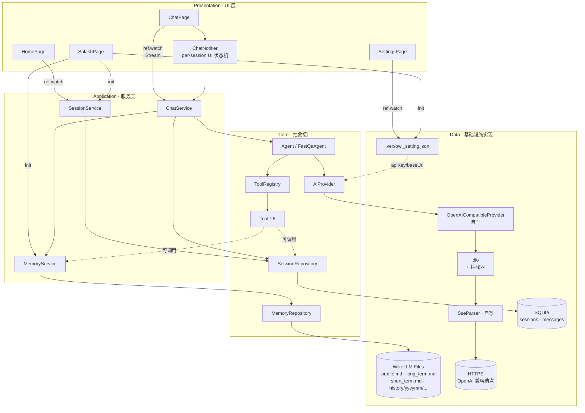
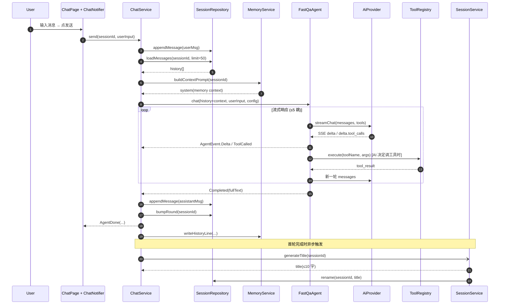
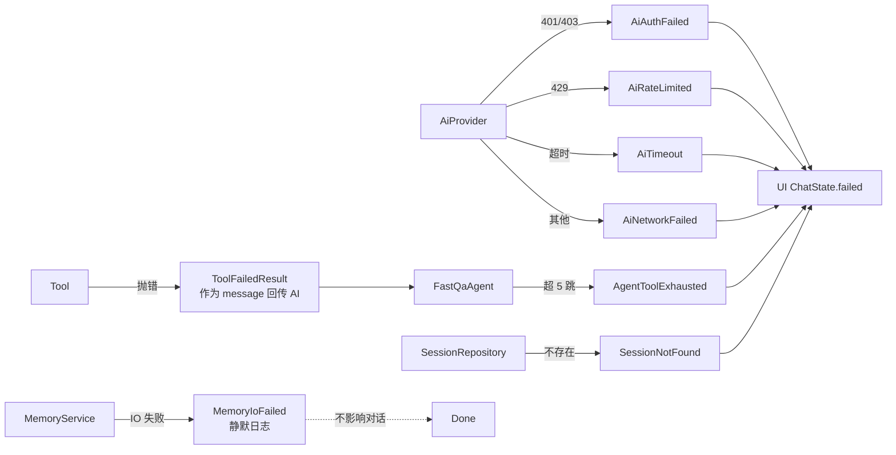

# 服务层

> 服务层是 UI 与底层 IO / AI / 文件之间的中间层。本文档定义 v1.x 服务层
> 的接口、依赖关系、状态机与并发模型。
>
> 与 [架构设计.md](架构设计.md) / [WikeLLM记忆.md](WikeLLM记忆.md) 配套阅读。

---

## 1. 设计目标

| 目标 | 含义 |
|------|------|
| 无状态服务 | SessionService / ChatService / AgentService 不持会话状态;每次调用把 `sessionId` 作为参数传入 |
| 快用快答、快速释放 | 调用结束立即返回 Future,无后台协程残留;Riverpod `family` 仅用于 UI 端 ChatState(纯视图状态机) |
| 可纯 Dart 单测 | 服务层不依赖 Flutter Widget;测试可使用 `package:test` + 内存 Repository 替身 |
| 接口与实现分离 | 所有 IO、AI 调用走抽象接口(`ConversationRepository` / `MemoryRepository` / `AiProvider`),便于替换与 mock |

---

## 2. 服务一览

| 服务 | 职责 | 状态 |
|------|------|------|
| `SessionService` | 会话生命周期(创建/重命名/置顶/取消置顶/删除);首轮结束后调 AI 起名 | 无状态(参数含 `sessionId`) |
| `ChatService` | 单轮对话编排(乐观推用户消息 → 调 Agent → 流式更新 → 写记忆 → 轮次 +1 → 首轮起名) | 无状态 |
| `MemoryService` | WikeLLM 读写、跨域查询合并;暴露给 `MemoryQueryTool` / `HistoryQueryTool` | 无状态 |
| `Agent` (抽象) / `FastQaAgent` | 调用 `AiProvider`,调度 `ToolRegistry`,产出 `Stream<AgentEvent>` | 无状态;`ToolRegistry` 在启动时一次性注册 |

> Riverpod 仅在 UI 层用来管理 ChatState(流式进度、错误、用户消息列表等)。服务本身可脱离 Riverpod 调用。

---

## 2.5 整体架构图

下图展示 v1.x 服务层、Repository、AI Provider、Tool、UI 与持久化层之间的整体关系。

### 2.5.1 分层与依赖



> 实线 = 强依赖调用,虚线 = 配置注入或可选调用。
> `Tool` 可选访问 `MemoryService` / `SessionRepository`(如 `memory_query` / `history_query`)。

### 2.5.2 一轮对话的运行时数据流



### 2.5.3 持久化边界

```mermaid
flowchart LR
  subgraph VEX[&lt;root&gt;/.vex/]
    direction TB
    CFG[owl_setting.json<br/>OwlConfig]
    MEM[memory/]
  end

  subgraph MEM
    direction TB
    PROFILE[profile.md]
    SHORT[short_term.md]
    LONG[long_term.md]
    HIST[history/<br/>yyyymm/yyyymmdd.md]
  end

  subgraph DB[(本地 SQLite)]
    direction TB
    SESS[sessions]
    MSG[messages]
  end

  CFG -- OwlConfig --> AiProvider
  PROFILE -- 跨域查询 --> MemoryQueryTool
  SHORT -- 滚动 7 天 --> MemoryQueryTool
  LONG -- 全文 --> MemoryQueryTool
  HIST -- 按日 / 关键字 --> HistoryQueryTool

  SESS <--> SessionService
  SESS <--> SessionRepository
  MSG  <--> SessionRepository
  MSG  <--> ChatService
```

| 数据类型 | 落点 | 理由 |
|----------|------|------|
| 会话 / 消息 / 轮次 / 置顶 | SQLite(`sessions` / `messages`) | 关系型、高频读写、按 id 查询 |
| 配置(API Key / baseUrl / model) | `.vex/owl_setting.json` | 与 [技术选型.md § 5.1](技术选型.md) 一致 |
| 个人画像 / 短期 / 长期 / 历史摘要 | WikeLLM `.vex/memory/` | 透明、人可读、可迁移 |

### 2.5.4 错误传播边界



---

## 3. 接口契约

### 3.1 `SessionService`

#### 3.1.1 职责

`SessionService` 负责**会话(Session)的生命周期**:

- 创建 / 重命名 / 置顶 / 取消置顶 / 删除会话;
- 在首轮对话完成后,调用 AI 生成 ≤10 个中文字的会话标题;
- 通过 `SessionRepository` 持久化 SQLite 表 `sessions`;
- 删除会话时通知 `MemoryService` 在 WikeLLM `history/` 中标记「已删除」(可选);
- **不**负责会话中的消息内容、Agent 调用、记忆写入 —— 这些属于 `ChatService` / `Agent` / `MemoryService`。

#### 3.1.2 数据模型:Session

| 字段 | 类型 | 约束 | 说明 |
|------|------|------|------|
| `id` | TEXT PK | NOT NULL,UUID v4 | 会话唯一标识 |
| `title` | TEXT | NOT NULL,长度 ≤ 32(留余) | 首轮后由 AI 生成;新建时为「新对话」 |
| `agentId` | TEXT | NOT NULL,默认 `fast-qa` | v1 阶段固定单 Agent;v2.0 扩展 |
| `pinned` | INTEGER(0/1) | NOT NULL,默认 0 | Home 列表置顶排序 |
| `round` | INTEGER | NOT NULL,默认 0 | 每完成一轮 Assistant 回复 +1 |
| `createdAt` | INTEGER | NOT NULL | UTC ms epoch |
| `updatedAt` | INTEGER | NOT NULL | 任意修改时刷新 |
| `deleted` | INTEGER(0/1) | NOT NULL,默认 0 | 软删除标记(便于 WikeLLM history 同步) |

> 不可变值类型(`@immutable`),所有修改通过 `copyWith` 产生新实例。

#### 3.1.3 SQLite 表结构(Drift)

```sql
CREATE TABLE sessions (
  id          TEXT    PRIMARY KEY NOT NULL,
  title       TEXT    NOT NULL DEFAULT '新对话',
  agent_id    TEXT    NOT NULL DEFAULT 'fast-qa',
  pinned      INTEGER NOT NULL DEFAULT 0,
  round       INTEGER NOT NULL DEFAULT 0,
  created_at  INTEGER NOT NULL,
  updated_at  INTEGER NOT NULL,
  deleted     INTEGER NOT NULL DEFAULT 0
);

-- Home 列表排序:pinned DESC + updated_at DESC,只覆盖未删除会话
CREATE INDEX idx_sessions_list ON sessions(pinned DESC, updated_at DESC)
  WHERE deleted = 0;
```

> `idx_sessions_list` 使用部分索引(partial index),减少写入放大;
> Drift 中通过 `customStatement` 注册。

**迁移历史**(`migrations.dart`):

| 版本 | 变更 |
|------|------|
| v1 | 新建 `sessions` 表 + 索引 |
| v2(预留) | 新增 `summary` 字段(预留给「会话级压缩摘要」) |

#### 3.1.4 接口契约

| 方法 | 入参 | 出参 | 行为 |
|------|------|------|------|
| `create({agentId})` | `agentId='fast-qa'` | `Future<Session>` | 落库新会话;立刻出现在 `watchAll()` 流中 |
| `watchAll()` | — | `Stream<List<Session>>` | 订阅会话列表;SQL 层按 `pinned DESC, updated_at DESC` 排序;过滤 `deleted=1` |
| `findById(sessionId)` | sessionId | `Future<Session?>` | 单条查询;不存在返回 null |
| `rename(sessionId, newTitle)` | sessionId + 新标题 | `Future<void>` | 长度裁剪至 32 字;空字符串抛 `SessionValidationError(EmptyTitle)`;同步刷新 `updatedAt` |
| `pin(sessionId)` | sessionId | `Future<void>` | 置顶 |
| `unpin(sessionId)` | sessionId | `Future<void>` | 取消置顶 |
| `delete(sessionId)` | sessionId | `Future<void>` | 软删除:写 `deleted=1`;通知 `MemoryService` 在 WikeLLM history 标记「已删除」 |
| `purge(sessionId)` | sessionId | `Future<void>` | 物理删除;**谨慎使用**(回收站「彻底删除」场景) |
| `generateTitle(sessionId)` | sessionId | `Future<String>` | 调 AI 起名(≤10 字);失败兜底为「首条用户消息前 10 字」 |

#### 3.1.5 `generateTitle` 降级策略

```
1) 加载最近 4 条消息
2) 调 AI(轻量, temperature=0.3, maxTokens=32) → 摘要 ≤10 字
3) 若成功且非空 → rename → 返回
4) 失败/超时/空 → 取首条用户消息 → 截断 10 字 → rename → 返回
```

**去抖策略**:SessionService 内部**不去抖**;由 ChatService 在首轮结束后调用,避免同一 session 多实例并发覆盖。

#### 3.1.6 校验与异常

| 异常 | 触发条件 | 处理 |
|------|----------|------|
| `SessionValidationError(EmptyTitle)` | `rename` 收到空字符串 | UI 弹 SnackBar「标题不能为空」 |
| `SessionValidationError(TooLong)` | `rename` 后长度 > 32 | 服务端裁剪;理论上 UI 已截断,此处兜底 |
| `SessionNotFoundError` | `sessionId` 不存在 | UI 弹 SnackBar「会话不存在」,并从本地列表移除 |
| `AiCallFailed` | 起名 AI 调用失败 | 内部 catch 走兜底,不向 UI 抛 |

> 业务异常统一为非受检异常,继承 `SessionServiceException`。
> UI 层捕获后决定是否 SnackBar。

#### 3.1.7 排序规则

Home 列表读取 `watchAll()` 后,在 Repository 内部按 SQL 排序:

```
ORDER BY pinned DESC, updated_at DESC
```

UI 不再做内存排序,避免与数据库状态分叉。

#### 3.1.8 与其他服务的协作

| 触发场景 | 协作服务 | 顺序 |
|----------|----------|------|
| `ChatService` 首轮完成 | `SessionService.generateTitle(id)` | 异步触发,**不阻塞**用户当前 UI |
| 用户手动删除会话 | `SessionService.delete(id)` | 同步;后续可选通知 `MemoryService` |
| 用户置顶 | `SessionService.pin(id)` | 同步;列表立刻重排(Stream 推送) |
| 重命名 | `SessionService.rename(id, title)` | 同步;Stream 推送更新 |

#### 3.1.9 测试要点

| 用例 | 期望 |
|------|------|
| `create` 后 `findById` 能取回 | ✅ |
| `create` 后 `watchAll` 立即看到新会话 | ✅ |
| `pin` 后 `watchAll` 排序:置顶在前 | ✅ |
| `delete` 后 `watchAll` 不再返回该会话 | ✅ |
| `purge` 后 SQLite 中无该行 | ✅ |
| `rename('', ...)` 抛 `SessionValidationError(emptyTitle)` | ✅ |
| `rename('a'*40, ...)` 后 SQLite 存的是裁剪后 ≤32 字 | ✅ |
| `generateTitle` 在 messages 空时返回「新对话」 | ✅ |
| `generateTitle` 在 AI 失败时走兜底(首条用户消息截断) | ✅ |
| `generateTitle` 重复调用: 允许覆盖(由 ChatService 控制调用频次) |

测试夹具:`InMemorySessionRepository`(实现 `SessionRepository` 接口)
+ `MockAiProvider`(`mocktail`)替代真实 AI 调用。

#### 3.1.10 v1.x 待办

- [ ] SQLite 迁移 v2:`sessions.summary` 字段(压缩后摘要)
- [ ] 「回收站」UI(列出 `deleted=1` 的会话,提供「恢复 / 彻底删除」)
- [ ] 批量操作(多选删除 / 置顶)

### 3.2 `ChatService`

#### 3.2.1 职责

`ChatService` 负责**单轮对话的完整编排**:

- 接收用户输入 → 持久化用户消息 → 加载历史 + 记忆上下文 → 调 Agent 流式生成;
- 流式事件 `AgentDelta / ToolCalled / Completed / Failed` 通过 `Stream<ChatEvent>` 推到 UI;
- 完成时:bump session 轮次 + 写 WikeLLM `history/` + 首轮结束触发 `SessionService.generateTitle(...)`;
- **不**负责 UI ChatState(由 ChatPage 的 `Notifier` 维护);
- **不**负责会话本身(由 `SessionService` 维护)。

#### 3.2.2 事件类型 `ChatEvent`

| 事件 | 含义 | UI 行为 |
|------|------|----------|
| `UserEcho(content)` | 用户消息已落库(可选,用于 UI 确认持久化) | 可忽略(乐观更新已展示) |
| `AgentDelta(text)` | Agent 流式吐出的文本片段 | 追加到 assistant draft |
| `AgentToolCalled(name, args)` | Agent 触发了一个工具调用 | 在 assistant draft 上方/下方展示小标签(不阻塞 UI) |
| `AgentDone(fullText, promptTokens, completionTokens)` | 本轮完成 | finalize assistant draft;清空 sending 标志 |
| `AgentFailed(error)` | 本轮失败(超时/鉴权/网络) | 保留已收到的 assistant 内容;展示「重试」按钮 |

#### 3.2.3 接口契约

| 方法 | 入参 | 出参 | 行为 |
|------|------|------|------|
| `send({conversationId, userInput})` | sessionId + 用户文本 | `Stream<ChatEvent>` | 触发一轮完整对话;返回的 Stream 单订阅,完成后自动关闭 |
| `cancel(conversationId)` | sessionId | `Future<void>` | 取消进行中的轮次(用户主动中断);Agent 收到 `Failed(ChatCancelled)` |

> 单订阅约束:同一 conversationId 同一时刻最多一个 `send()` 在跑;
> 若重复调用,第二个调用立即抛 `ChatBusyError`。

#### 3.2.4 处理流水线

```
send() 被调用
  ├─ 1) 校验:sessionId 存在、userInput 非空、当前无 in-flight 轮次
  ├─ 2) 持久化用户消息 → SessionRepository.appendMessage(userMsg)
  ├─ 3) 加载历史:SessionRepository.loadMessages(conversationId, limit=N)
  ├─ 4) 加载记忆上下文:MemoryService.buildContextPrompt(conversationId)
  ├─ 5) 调用 Agent:Agent.chat(sessionId, history+context, userInput, config)
  │      ↓ 流式事件
  │     ├─ Delta → 透传 AgentDelta
  │     ├─ ToolCalled → 透传 AgentToolCalled(并记录工具轨迹)
  │     ├─ Completed → 持久化 assistant 消息 → bumpRound → 写 history
  │     └─ Failed → 透传 AgentFailed
  └─ 6) 收尾:
       ├─ 若轮次 == 1(首轮刚完成) → SessionService.generateTitle(id)
       │                              (异步、不阻塞 Stream 关闭)
       └─ MemoryService.writeHistoryLine(...)
```

#### 3.2.5 上下文拼装

发给 Agent 的 `messages` 顺序:

```
[system(灵枭助手 system prompt)]
[system(memory context · profile + shortTerm + 当月 history)]    ← 由 MemoryService.buildContextPrompt
[history... · limit N]                                          ← SQLite 加载
[user(currentInput)]
```

约束:
- 总 token 上限 ~8K,超过则按窗口滑动截断 `history` 末尾(详见 v1.x 预留)。
- `system(memory context)` 用 `cache_control` hint(若 Provider 支持)避免每次重算。

#### 3.2.6 取消与重试

- **取消**:`ChatService.cancel(id)` 通过 `CancelToken` 通知 Agent 主动关闭流;
  UI 显示「已中断」,保留已收到的 assistant 内容。
- **重试**:UI 在 `AgentFailed` 后,允许用户点击「重试」重新调 `send(...)`,
  ChatService 不做内部重试 —— 重试策略集中在 UI/调用方。

#### 3.2.7 错误处理

| 异常 | 触发条件 | 处理 |
|------|----------|------|
| `ChatBusyError` | 同一 session 已有 in-flight | UI 立即弹 SnackBar「上一个请求还在进行」 |
| `ChatCancelled` | 用户主动取消 | UI 显示「已中断」,不重试 |
| `ChatValidationError(EmptyInput)` | `userInput.trim().isEmpty` | 内部校验,不进入流水线 |
| `ChatSessionNotFound` | sessionId 不存在 | UI 显示「会话不存在」+ 回 Home |
| `AiAuthFailed` | AI 401/403 | UI 引导到 Settings;Stream 关闭 |
| `AiRateLimited` | AI 429 | UI 显示「请求过于频繁」;不自动重试(调用方决定) |
| `AiTimeout` | 30s 硬超时 | UI 显示「网络超时」+ 重试 |
| `AiNetworkFailed` | 其他网络异常 | UI 显示「网络异常」+ 重试 |

#### 3.2.8 并发模型

- **单订阅**:同一 sessionId 同时只能有一个 send in-flight;
  由 ChatService 内部 `Map<sessionId, inFlightGuard>` 保证。
- **跨 session 完全独立**:不同 session 的 send 互不阻塞,可并发。
- **取消传播**:UI 调用 `cancel(id)` → ChatService 找到对应 CancelToken → Agent 关闭流。
- **写 WikeLLM 串行化**:MemoryService 内部 Future 队列(见 WikeLLM 文档 §8)。

#### 3.2.9 性能护栏

- **历史消息加载上限**:默认 50 条;超过则尾部截断。
- **首轮起名异步**:不阻塞 Stream 关闭,后台默默跑。
- **工具调用预算**:由 Agent 控制(默认 ≤5 跳),ChatService 不再设上限。

#### 3.2.10 测试要点

| 用例 | 期望 |
|------|------|
| 发送空字符串抛 `ChatValidationError(EmptyInput)` | ✅ |
| 同一 session 并发 send 抛 `ChatBusyError` | ✅ |
| 正常 send:UserEcho → 多个 AgentDelta → AgentDone 顺序正确 | ✅ |
| send 中调 cancel → 流立即关闭且收到 `AgentFailed(ChatCancelled)` | ✅ |
| Agent 401 → Stream 收到 `AgentFailed(AiAuthFailed)` | ✅ |
| 首轮完成后:`SessionService.generateTitle` 被调用 1 次 | ✅ |
| 失败重试:UI 调 send 第二次不阻塞(第一次已结束) | ✅ |
| 历史消息限制:超 50 条时只发最近 50 条给 Agent | ✅ |

测试夹具:`MockSessionRepository` / `MockMemoryService` / `MockAgent`
(均实现各自接口,用 `mocktail` 桩)。

#### 3.2.11 v1.x 待办

- [ ] 上下文压缩:超出 token 上限自动摘要压缩
- [ ] 多模态输入(图片附件)
- [ ] 会话内「重新生成」按钮(整轮重发)
- [ ] `send` 内部支持 `temperature / topP / maxTokens` 等 Provider 参数透传

### 3.3 `MemoryService`

```dart
abstract class MemoryService {
  /// 写短期记忆(滚动 N 天)。
  Future<void> appendShortTerm(String conversationId, String summary);

  /// 写长期记忆(仅追加)。
  Future<void> appendLongTerm(String content);

  /// 更新画像(整段覆盖,纯 Markdown)。
  Future<void> writeProfile(String markdown);

  /// 写当日历史摘要(每会话一行)。
  Future<void> writeHistoryLine({
    required String conversationId,
    required String title,
    required String summary,
  });

  /// 跨域查询:命中 WikeLLM 文件 + 必要时关联 SQLite 会话标题。
  Future<MemoryQueryResult> query(String scope, String keyword);

  /// 给 Agent 当上下文:拉取 profile + 最近 shortTerm + 当月 history 摘要。
  Future<String> buildContextPrompt(String conversationId);
}
```

### 3.4 Agent:完全自写 FastQaAgent

> v1.x 不依赖第三方 Agent SDK,由本服务**自行实现** FastQaAgent。
> 涉及的工程量:
> - OpenAI 兼容协议的 SSE 流式响应解析
> - `delta.tool_calls` 按 `index` 的增量拼装
> - 工具调用循环(最多 5 跳,防死循环)
> - 流取消传播(dio CancelToken)
> 设计目标:领域内最薄实现,工程上有边界,**只**负责把 SSE 转译成 `AgentEvent`。

#### 3.4.1 抽象:Agent(本服务视角)

```dart
abstract class Agent {
  String get id;          // 'fast-qa'
  String get displayName;  // '快速问答'

  Stream<AgentEvent> chat({
    required String conversationId,
    required String userInput,
    required OwlConfig config,
  });
}

sealed class AgentEvent { const AgentEvent(); }
class Delta       extends AgentEvent { final String text; }
class ToolCalled  extends AgentEvent { final String name; final Map<String, dynamic> args; }
class Completed   extends AgentEvent { final String fullText; final int promptTokens; final int completionTokens; }
class Failed      extends AgentEvent { final Object error; }
```

#### 3.4.2 实现:FastQaAgent(自写)

`FastQaAgent` 是**领域内编排器**,内部按以下步骤工作:

```
ChatService.send() → FastQaAgent.chat(...)
  ├─ 1) 由 ChatService 传入 history(已加载)+ system(memory context) + userInput
  ├─ 2) 构造 messages:
  │     [system(prompt)] [system(memory)] [history...] [user(currentInput)]
  ├─ 3) 工具列表:注入 6 个 Tool(详见 §3.5)
  ├─ 4) 进入对话循环(maxRounds = 5):
  │     ├─ AiProvider.streamChat(messages, tools)
  │     ├─ 边解析 SSE 边:
  │     │     ├─ delta.content       → 对外吐 AgentEvent.Delta
  │     │     ├─ delta.tool_calls[k] → 按 index 累计 toolCalls[k]
  │     │     └─ finish_reason       → 退出本轮
  │     ├─ 本轮若含 tool_calls:
  │     │     ├─ 对外吐 AgentEvent.ToolCalled(name, args)
  │     │     ├─ ToolRegistry.execute(name, args) → toolResult
  │     │     ├─ 把 toolResult 作为 role:'tool' 消息拼回 messages
  │     │     └─ 进入下一轮
  │     └─ 否则视为终态:
  │           └─ 对外吐 AgentEvent.Completed(fullText, 0, 0)
  └─ 5) 异常 → 对外吐 AgentEvent.Failed(error)
```

工具调用循环约束:

| 参数 | 默认 | 含义 |
|------|------|------|
| `maxRounds` | 5 | 防止 AI 反复调工具导致无限循环 |
| 工具并发 | 串行执行 | v1.x 简单实现,后续按需并发 |

#### 3.4.3 AiProvider(自写抽象)

```dart
abstract class AiProvider {
  /// 流式调用 OpenAI 兼容 chat/completions。
  /// 返回 SSE 解析后的流式「delta 项」,由 FastQaAgent 进一步转译。
  Stream<AiDelta> streamChat({
    required String model,
    required List<Map<String, dynamic>> messages,
    required List<Map<String, dynamic>> tools,
    required String apiKey,
    required String baseUrl,
    CancelToken? cancelToken,
  });
}

/// AiProvider 一次产出的小事件;FastQaAgent 把这些事件累计后再发 AgentEvent。
sealed class AiDelta { const AiDelta(); }
class ContentDelta   extends AiDelta { final String text; }
class ToolCallsDelta extends AiDelta { final int index; final String? name; final String? argumentsFragment; }
class FinishDelta    extends AiDelta { final String reason; }
class UsageDelta     extends AiDelta { final int promptTokens; final int completionTokens; }
```

#### 3.4.4 OpenAICompatibleProvider(实现)

```
OpenAICompatibleProvider
  ├─ dio.get<ResponseBody>(url, options: Options(responseType: ResponseType.stream))
  ├─ response.data.stream  →  String chunks
  ├─ SseParser.parse(chunks)  →  List<SseEvent>
  ├─ 每个 SseEvent.data 是 JSON,解析为:
  │     choices[0].delta.content        → ContentDelta
  │     choices[0].delta.tool_calls[k]  → ToolCallsDelta(index, name, argsFragment)
  │     choices[0].finish_reason        → FinishDelta(reason)
  │     usage                           → UsageDelta
  └─ 输出:Stream<AiDelta>
```

dio 客户端由 `DioFactory.create({apiKey, baseUrl, timeout})` 构造,
默认拦截器:

| 拦截器 | 用途 |
|--------|------|
| `AuthorizationInterceptor` | 自动注入 `Authorization: Bearer <apiKey>` |
| `LoggingInterceptor` | 开发期打印请求/响应元数据 |
| `RetryOn429Interceptor` | 遇 429 退避重试 ≤ 2 次 |

#### 3.4.5 SseParser(自写)

职责:把 UTF-8 字节流转为「以 `data: ` 开头的完整 SSE 事件」。

```
input: Stream<String>(chunk)
output: Stream<SseEvent>(data: String, event: String?, id: String?)

规则:
  - 行以 "data: " 开头 → 累积到当前事件的 data 字段
  - 行以 "event: " 开头 → 设置当前事件类型
  - 行以 "id: " 开头   → 设置 id
  - 空行              → 吐出一个完整事件
  - "data: [DONE]"    → 结束流
```

#### 3.4.6 取消与重试

- **取消**:`FastQaAgent` 持有 `CancelToken`,UI 调 `ChatService.cancel(id)` →
  调 `cancelToken.cancel('user_cancelled')` → dio 中断底层 socket → 流关闭。
- **重试**:`FastQaAgent` 不做内部重试;遇到 5xx / 超时时由 `ChatService` 重新发起 `chat(...)`。
- 429 重试由 `RetryOn429Interceptor` 兜底,默认指数退避(0.5s / 1.5s)。

#### 3.4.7 Provider 选型

| Provider | 选择 | 备注 |
|----------|------|------|
| 云端 | `OpenAICompatibleProvider`(自写) | 走 minimax 的 OpenAI 兼容 `baseUrl`,从 `OwlConfig` 注入 |
| 本地(v2.x 预留) | 不实现 | 文档暂不展开,后续评估 |

#### 3.4.8 与服务层的边界

| 职责 | FastQaAgent | ChatService |
|------|-------------|-------------|
| 组装 system prompt + history + memory context | ❌ | ✅ |
| 调 AiProvider 并转译 SSE → AgentEvent | ✅ | ❌ |
| 工具调用循环(最多 5 跳) | ✅ | ❌ |
| ToolRegistry.execute | ✅(内部) | ❌ |
| 监听 Stream<AgentEvent> 推到 UI | ❌ | ✅ |
| 持久化消息 / bumpRound / 首轮起名 | ❌ | ✅ |
| 写 WikeLLM history | ❌ | ✅ |

#### 3.4.9 测试要点

| 用例 | 期望 |
|------|------|
| 正常 chat:产生 `Delta*` → `Completed` 序列 | ✅ |
| AI 决定调工具:产生 `ToolCalled`,工具结果回灌,UI 看到工具标签 | ✅ |
| 流式中断(取消):最后一个 Delta 仍可见,后续不发 Completed | ✅ |
| 401 → `Failed(AiAuthFailed)` | ✅ |
| 429 → 拦截器自动重试 ≤ 2 次,最终仍失败 → `Failed(AiRateLimited)` | ✅ |
| `delta.tool_calls` 按 index 增量拼装 → 完整 args 解析后执行 | ✅ |
| 工具调用超 maxRounds → 强制终止并把已有结果作为 Completed | ✅ |

测试夹具:`MockAiProvider`(实现 `AiProvider` 接口),
返回受控 `Stream<AiDelta>`;`SseParser` 用 chunked 字符串流做边界测试。

### 3.5 `Tool` & `ToolRegistry`

```dart
abstract class Tool {
  String get name;
  String get description;
  Map<String, dynamic> get parameters; // JSON schema

  Future<String> execute(Map<String, dynamic> args);
}

class ToolRegistry {
  void register(Tool tool);
  Tool? find(String name);
  Iterable<Tool> get all;
}
```

v1.x 内置 6 个工具:

| 工具 | 名称 | 用途 |
|------|------|------|
| 时间 | `get_current_time` | 返回 ISO8601 与本地时区 |
| 文件 | `list_files` / `read_file` | 限定在 `.vex/` 沙盒路径下 |
| 媒体 | `media_meta` | 返回图片/视频/音频基本元信息占位(仅返回大小与类型) |
| 计算 | `calculator` | 安全的四则 + 括号表达式求值 |
| 记忆查询 | `memory_query` | 调 `MemoryService.query(scope, keyword)` |
| 历史查询 | `history_query` | 按日期/关键字检索 WikeLLM `history/` |

---

## 4. 状态机(UI 端 ChatState)

> ChatState 仅由 UI 持有(每个 ChatPage 一个 `Notifier`),与服务层正交。

```
idle
  └─ send() → optimisticAppend(user) → thinking
thinking
  ├─ delta → append(assistantDraft) → thinking
  ├─ toolCalled → recordToolCall → thinking
  ├─ done → finalize → idle
  └─ failed → setError → idle
```

`thinking` 期间输入框禁用,`failed` 期间保留已收到的 assistant 内容,UI 显示「重试」按钮。

---

## 5. 并发模型

- **会话级隔离**:无状态服务,每次调用都带 `conversationId`,内部若需互斥就用 `ConversationRepository` 的 per-row lock(后续)。
- **AI 流**:每个 `FastQaAgent.chat` 调用返回一个 `Stream`,UI 通过 `Notifier` 订阅;调用结束(Stream 关闭)即释放所有内部资源。
- **工具执行**:`tool.execute` 是 `Future<String>`,Agent 串行执行(同一轮内 tool 不并发,避免 prompt 拼接乱序)。
- **写记忆**:`MemoryService` 内部用单 `Future` 串行锁,避免并发写同一文件错乱。

---

## 6. 时序

### 6.1 发送消息

```
ChatPage.send(text)
  ↓
ChatNotifier.send() → optimisticAppend(user)
  ↓
ChatService.send(conversationId, userInput).listen:
  ├─ UserEcho        → ignore (already shown)
  ├─ AgentDelta      → assistantDraft += text
  ├─ AgentToolCalled → record(toolCall)
  ├─ AgentDone       → finalize assistantDraft
  └─ AgentFailed     → setError(e)

ChatService 内部:
  1. ConversationRepository.appendMessage(userMsg)
  2. ConversationRepository.loadMessages(conversationId) → history
  3. MemoryService.buildContextPrompt(conversationId) → context
  4. FastQaAgent.chat(history+context, userInput) → Stream<AgentEvent>
     ├─ 命中 tool_calls → ToolRegistry.execute → 新一轮 AI
     └─ 完成 → ConversationRepository.appendMessage(assistantMsg)
  5. ConversationRepository.bumpRound(conversationId)
  6. 若 conv.round == 1 (本轮刚完成首轮) → SessionService.generateTitle(...)
  7. MemoryService.writeHistoryLine(...)
```

### 6.2 删除会话

```
HomePage 删除 → SessionService.delete(id)
  ├─ SessionRepository.delete(id)
  └─ MemoryService.writeHistoryLine(...) 标记「已删除」(可选)
```

### 6.3 重命名 / 置顶

```
HomePage 弹菜单 → SessionService.rename/pin(id)
  └─ SessionRepository.update(id, ...)
```

---

## 7. 错误处理

| 失败 | 处理 |
|------|------|
| AI 401/403 | UI 显示「鉴权失败,请到设置检查 API Key」,不重试 |
| AI 429 | 退避 5s 后自动重试,最多 3 次 |
| AI 超时 | 30s 硬超时,UI 显示「网络超时」+ 重试按钮 |
| 工具抛异常 | Agent 内部捕获,把错误以 `tool_result` 形式回传 AI 自行处理;超限则终止 |
| WikeLLM 文件 IO 失败 | 静默日志,不阻塞对话;UI 层不感知 |

---

## 8. 测试策略

| 层 | 工具 | 范围 |
|----|------|------|
| Service | `package:test` | SessionService / ChatService / FastQaAgent / Tool(用内存 Repository 替身) |
| Widget | `flutter_test` | HomePage / ChatPage / SettingsPage |

**目标覆盖率**:Service 层 ≥ 80%。

---

## 9. 后续演进(预留)

| 版本 | 变化 |
|------|------|
| v1.1 | `MemoryService` 支持向量检索(本地小模型) |
| v1.2 | `SessionService` 引入 per-id Mutex |
| v2.0 | 多 Agent 编排,`AgentRegistry` 替换单 Agent |